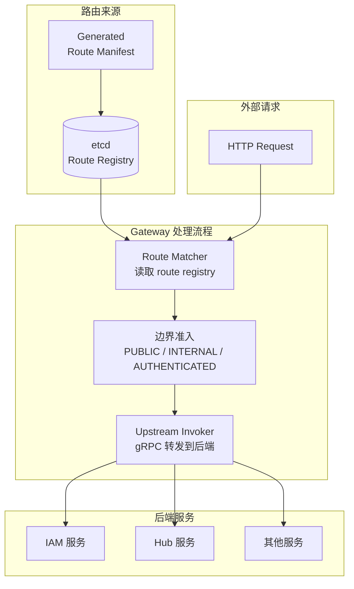

# Aisphere Gateway

Aisphere Gateway 是基于 `github.com/aisphereio/kernel` 的**边界网关服务**。它读取 route registry，将外部 HTTP 请求分发到后端业务服务（IAM、Hub 等），并处理边界准入。

## 架构



Gateway **不做** 资源级最终授权，不手写业务路由表，不直接暴露 INTERNAL 路由。

## 本地运行

```bash
go run ./cmd/aisphere-gateway -conf ./configs/config.local.yaml
```

默认端口：

- HTTP: `0.0.0.0:18000`
- gRPC admin: `0.0.0.0:19000`
- Metrics: `127.0.0.1:19100`

## Layout

```text
cmd/aisphere-gateway/    Application entrypoint
configs/                 Local config files
internal/conf/           Config DTOs scanned by configx
internal/data/           Kernel resource initialization (DB, Cache, Authn, Authz)
internal/dispatch/       JSON body invoker + IAM message factory
internal/registry/       Route registry client (etcd)
internal/server/         Kernel HTTP and gRPC server construction
internal/service/        Gateway admin service (route snapshot, reload, health, version)
```

## 验证

```bash
curl http://127.0.0.1:18000/healthz
curl http://127.0.0.1:18000/readyz
curl http://127.0.0.1:18000/v1/gateway/routes
```

## 依赖

- `github.com/aisphereio/kernel` — 核心框架
- `github.com/aisphereio/aisphere-iam` — IAM 服务（编译期绑定 gRPC invoker）
- etcd — route registry 存储