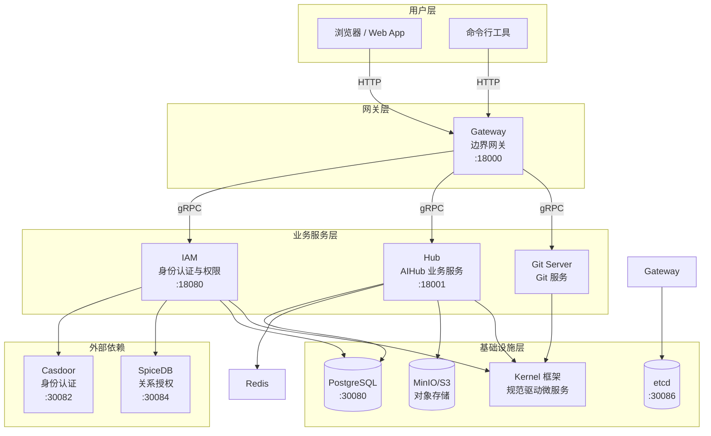
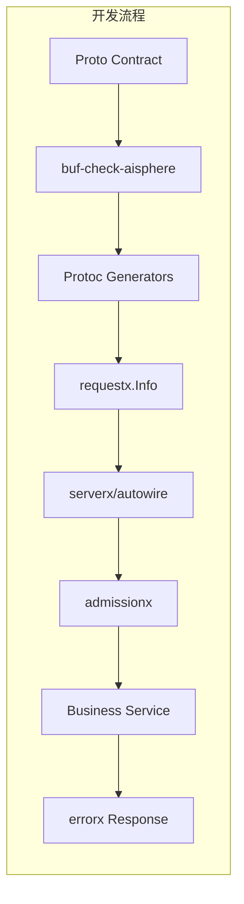
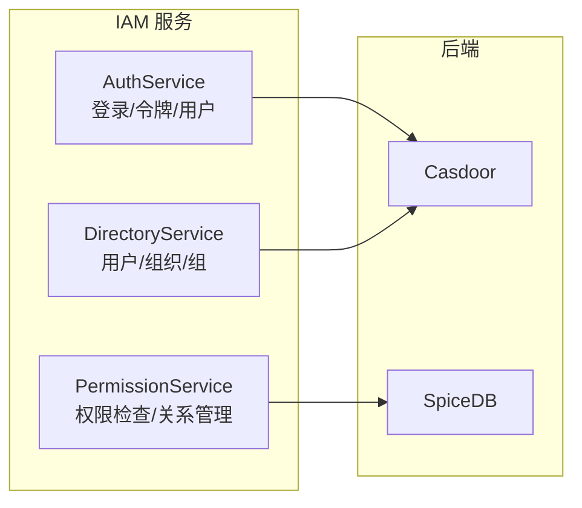
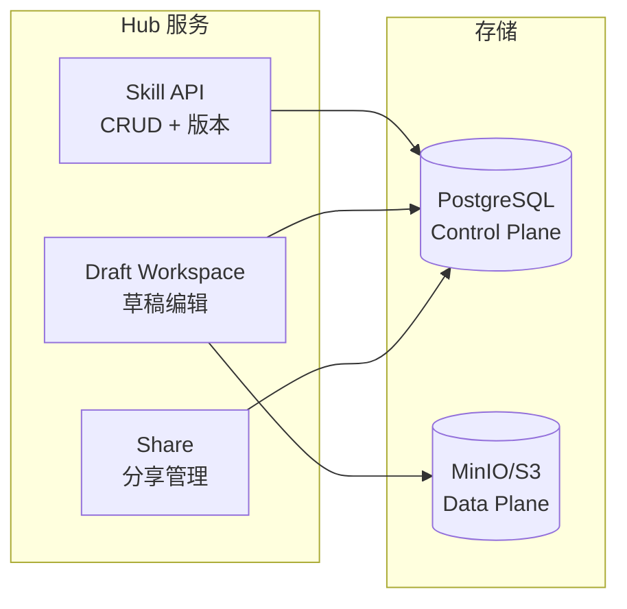
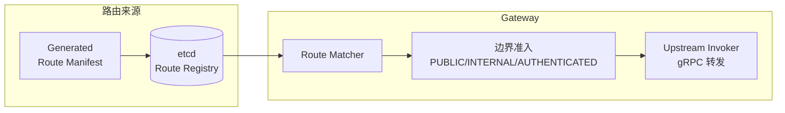
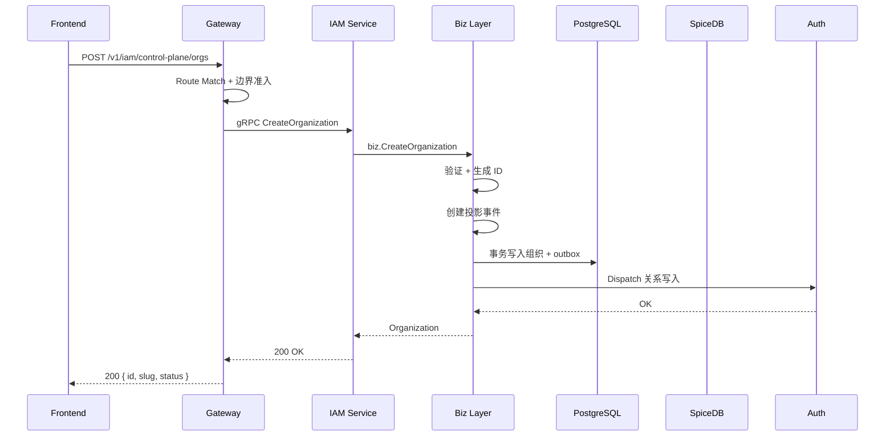

# 系统架构

## 整体架构



## 核心组件

### Kernel (github.com/aisphereio/kernel)
规范驱动微服务基础框架。提供 proto-first 开发范式、代码生成、治理中间件和运行时装配。



### IAM (github.com/aisphereio/aisphere-iam)
身份认证和权限管理服务。封装 Casdoor（认证）和 SpiceDB（授权），提供统一 IAM API。



### Hub (github.com/aisphereio/aisphere-hub)
AIHub 业务服务。管理技能目录、版本、包存储和分享工作流。



### Gateway (github.com/aisphereio/aisphere-gateway)
边界网关。读取 route registry，分发请求到后端服务，处理边界准入。



## 开发范式

```text
proto contract
  -> buf-check-aisphere
  -> protoc generators
  -> requestx.Info / accessx / gatewayx / serverx
  -> business service implementation
```

## 数据流示例

### 创建组织



## 端口映射

| Service | HTTP | gRPC | Metrics |
|---------|------|------|---------|
| IAM | `18080` | `19080` | `19180` |
| Gateway | `18000` | `19000` | `19100` |
| Hub | `18001` | `19001` | `19090` |
| Hub Front | `3000` | - | - |