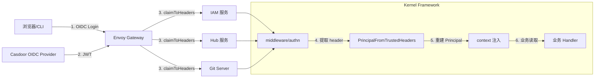
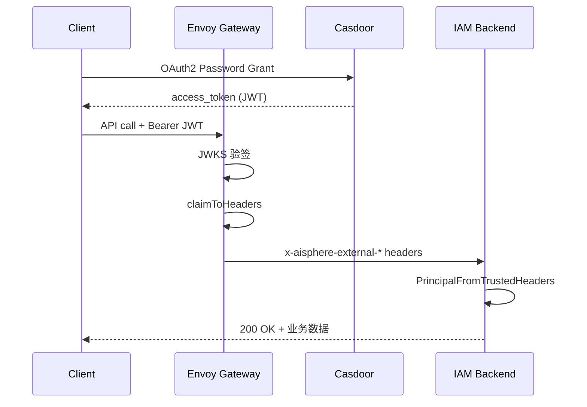
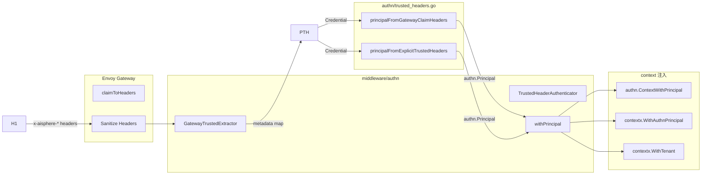
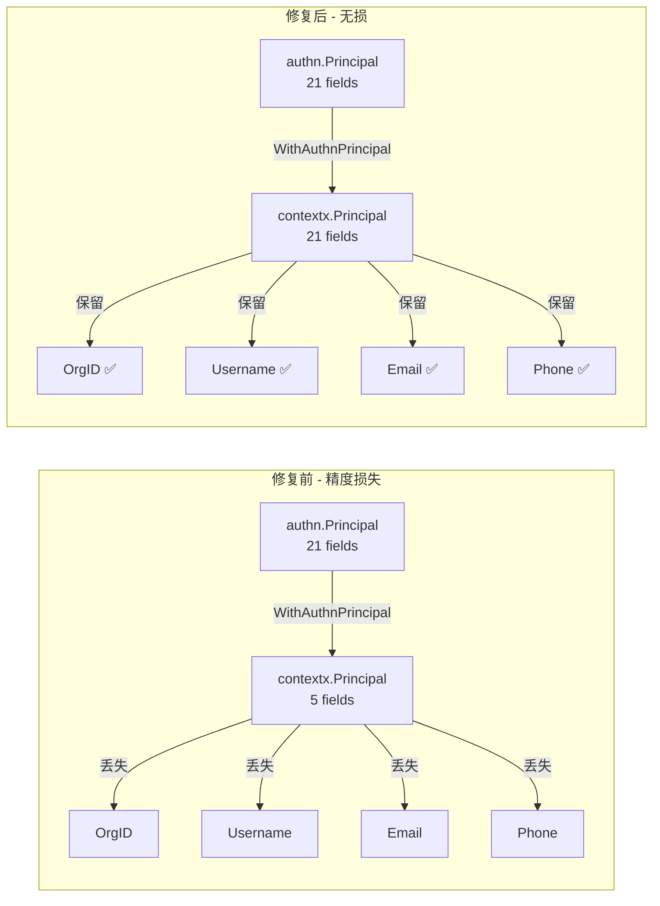
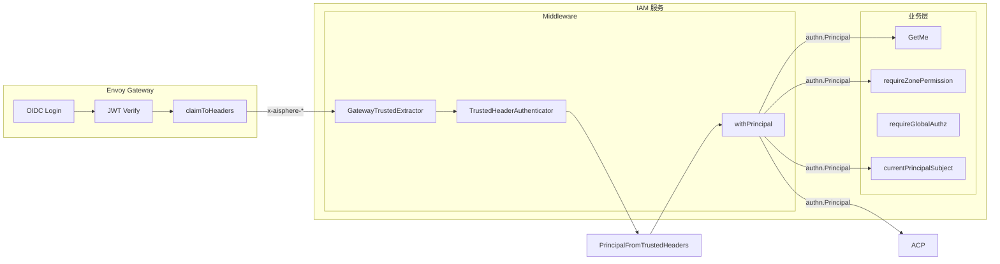
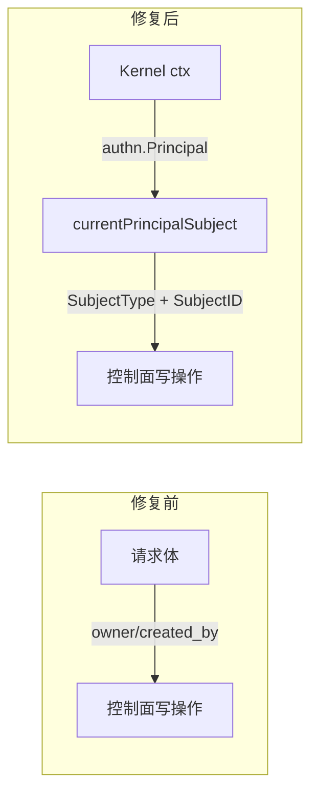

# 认证全链路：从 Casdoor JWT 到业务 Principal

## 1. 总体架构



**认证链路分 6 个阶段：**

| 阶段 | 组件 | 产出 |
|------|------|------|
| ① OIDC 登录 | Casdoor + Envoy Gateway | JWT |
| ② JWT 验签 | Envoy Gateway JWKS | 验证后的 JWT claims |
| ③ claimToHeaders | Envoy SecurityPolicy | `x-aisphere-external-*` HTTP headers |
| ④ Header 提取 | Kernel `GatewayTrustedExtractor` | `authn.Credential` |
| ⑤ Principal 重建 | `PrincipalFromTrustedHeaders` | `authn.Principal`（21 字段） |
| ⑥ Context 注入 | `withPrincipal` | `authn.ContextWithPrincipal` + `contextx.WithAuthnPrincipal` |

## 二、Casdoor JWT 结构

### 2.1 获取 Token



### 2.2 JWT Payload 示例

```json
{
  "owner": "aisphere",
  "name": "admin",
  "id": "496333c7-7acc-4717-8596-056544fc0a68",
  "type": "normal-user",
  "displayName": "管理员",
  "email": "user@example.com",
  "phone": "13800138000",
  "iss": "https://casdoor.example.com:30723",
  "sub": "496333c7-7acc-4717-8596-056544fc0a68",
  "aud": ["869aff97ab0408cbbd1c"],
  "exp": 1784106688,
  "iat": 1783501888,
  "tokenType": "access-token",
  "scope": "openid profile email",
  "owner": "aisphere",
  "roles": [],
  "groups": []
}
```

## 三、Envoy Gateway claimToHeaders 配置

### 3.1 配置

```yaml
claimToHeaders:
  # 主身份标识
  - claim: sub            → x-aisphere-external-sub
  - claim: iss            → x-aisphere-external-issuer
  - claim: email          → x-aisphere-external-email
  - claim: name           → x-aisphere-external-name
  - claim: displayName    → x-aisphere-external-display-name
  - claim: phone          → x-aisphere-external-phone
  - claim: owner          → x-aisphere-external-owner
  - claim: id             → x-aisphere-external-id
  - claim: scope          → x-aisphere-external-scope
  - claim: azp            → x-aisphere-external-authorized-party
  # 内部投影
  - claim: sub            → x-aisphere-principal
  - claim: id             → x-aisphere-user-id
  - claim: owner          → x-aisphere-org-id
```

### 3.2 完整字段映射表

| HTTP Header | JWT Claim | 值示例 | 说明 |
|-------------|-----------|--------|------|
| `x-aisphere-external-sub` | `sub` | `496333c7-...` | JWT 主体（用户 UUID） |
| `x-aisphere-external-issuer` | `iss` | `https://casdoor.example.com:30723` | JWT 签发者 |
| `x-aisphere-external-email` | `email` | `user@example.com` | 邮箱 |
| `x-aisphere-external-email-verified` | `email_verified` | `false` | 邮箱是否已验证 |
| `x-aisphere-external-name` | `name` | `admin` | 用户名 |
| `x-aisphere-external-display-name` | `displayName` | `管理员` | 显示名称 |
| `x-aisphere-external-phone` | `phone` | `13800138000` | 手机号 |
| `x-aisphere-external-owner` | `owner` | `aisphere` | Casdoor 组织 |
| `x-aisphere-external-id` | `id` | `496333c7-...` | Casdoor 用户 ID |
| `x-aisphere-external-type` | `type` | `normal-user` | 用户类型 |
| `x-aisphere-external-scope` | `scope` | `openid profile email` | OAuth2 scope |
| `x-aisphere-external-authorized-party` | `azp` | `869affc-...` | Client ID |
| `x-aisphere-principal` | `sub` | `496333c7-...` | 内部投影：Principal ID |
| `x-aisphere-user-id` | `id` | `496333c7-...` | 内部投影：用户 UUID |
| `x-aisphere-org-id` | `owner` | `aisphere` | 内部投影：组织 ID |

## 四、Kernel 框架处理链路

### 4.1 完整处理流程



### 4.2 健壮性设计

| 场景 | 行为 | 是否报错 |
|------|------|:-------:|
| Header 不存在 | `headerValue()` 返回空字符串 | ❌ |
| Header 值为空 | 对应 Principal 字段为空 | ❌ |
| Scopes 格式多样 | `splitCSV()` 支持逗号/分号/空格 | ❌ |
| SubjectID 完全缺失 | `principalFromGatewayClaimHeaders` 返回 `false` | ✅ 拒绝请求 |
| Internal token 不匹配 | `TrustedHeaderAuthenticator` 返回错误 | ✅ 拒绝 |

### 4.3 SubjectID 优先级

```text
1. x-aisphere-principal（GatewayClaimHeaderPrincipal）
2. x-aisphere-user-id（GatewayClaimHeaderUserID）
3. x-aisphere-external-id（GatewayClaimHeaderExternalID）
4. x-aisphere-external-sub（GatewayClaimHeaderExternalSub）
```

### 4.4 OrgID/TenantID 优先级

```text
1. x-aisphere-org-id（GatewayClaimHeaderOrgID）
2. x-aisphere-external-owner（GatewayClaimHeaderExternalOwner）
3. x-aisphere-owner（TrustedHeaderOwner）
```

## 五、PR #27：contextx.Principal 无损镜像

### 5.1 修复前 vs 修复后



### 5.2 字段对比

| 字段 | 修复前 | 修复后 |
|------|:------:|:------:|
| `SubjectID` | ✅ | ✅ |
| `SubjectType` | ❌ | ✅ |
| `Provider` | ❌ | ✅ |
| `ExternalID` | ❌ | ✅ |
| `Issuer` | ❌ | ✅ |
| `Audience` | ❌ | ✅ |
| `TenantID` | ✅ | ✅ |
| `OrgID` | ❌ | ✅ |
| `AppID` | ❌ | ✅ |
| `ProjectID` | ❌ | ✅ |
| `Username` | ❌ | ✅ |
| `Name` | ❌ | ✅ |
| `Email` | ❌ | ✅ |
| `Phone` | ❌ | ✅ |
| `Roles` | ✅ | ✅ |
| `Groups` | ❌ | ✅ |
| `Scopes` | ✅ | ✅ |
| `AuthMethod` | ✅ | ✅ |
| `Attributes` | ❌ | ✅ |
| `IssuedAt` | ❌ | ✅ |
| `ExpiresAt` | ❌ | ✅ |

## 六、IAM 后端 Principal 使用审计

### 6.1 认证模式

IAM 使用 `gateway_trusted` 模式，配置在 `internal/server/access.go:37`：

```go
if strings.EqualFold(cfg.Authn.Mode, securityx.AuthnModeGatewayTrusted) {
    internalCall.Enabled = false
    internalCall.Token = ""
}
```

### 6.2 完整认证链路



### 6.3 Principal 使用方式

| 文件 | 用途 | 方式 |
|------|------|------|
| `internal/service/iam.go:76` | `GetMe()` 获取当前用户 | `authn.PrincipalFromContext` |
| `internal/service/iam.go:159` | `requireZonePermission()` SpiceDB 检查 | `authn.PrincipalFromContext` |
| `internal/service/authz_admin.go:201` | `requireGlobalAuthz()` 全局权限检查 | `authn.PrincipalFromContext` |
| `internal/server/group_http.go:171` | `runWithGatewayPrincipal()` HTTP handler | `authn.PrincipalFromContext` |
| `internal/service/control_plane.go:507` | `currentPrincipalSubject()` 控制面辅助 | `authn.PrincipalFromContext` |

### 6.4 PR #29 修复：控制面 Actor 来源



| 写操作 | 修复前 | 修复后 |
|--------|:------:|:------:|
| `CreateOrganization.Owner` | `req.GetOwner()` | 强制来自 ctx Principal |
| `CreateProject.CreatedBy` | 请求体 | 来自 ctx Principal |
| `UpsertResource.CreatedBy` | `in.GetCreatedBy()` | 来自 ctx Principal |
| `BindResource.CreatedBy` | 请求体 | 来自 ctx Principal |
| `GrantAccess.CreatedBy` | 请求体 | 来自 ctx Principal |
| `RevokeAccess.Actor` | 请求体 | 来自 ctx Principal |

## 七、业务使用规则

### 7.1 推荐方式

```go
// ✅ 推荐：authn.PrincipalFromContext 是业务 authn/authz 主入口
p, ok := authn.PrincipalFromContext(ctx)
if !ok {
    return nil, authn.ErrUnauthenticated("")
}
userID := p.SubjectID // 用户稳定 UUID
orgID := p.OrgID      // Casdoor owner / Aisphere org 投影
email := p.Email
name := p.Name

// ✅ contextx.PrincipalFromContext 现在也是无损的
cp := contextx.PrincipalFromContext(ctx)
cp.OrgID    // ✅ 不再丢失
cp.Username // ✅ 不再丢失
cp.Email    // ✅ 不再丢失
```

### 7.2 禁止方式

```go
// ❌ 不要直接解析 Gateway header
// 业务 handler 不应该解析 x-aisphere-* header
// Kernel middleware 会自动完成 trusted headers → Principal → ctx 注入

// ❌ 不要信任请求体中的 owner/created_by/actor
// 控制面写操作的 Actor 必须从 ctx Principal 获取
```

## 八、验证记录

### 8.1 单元测试

```bash
# Gateway claim headers → Principal 路径
go test ./authn -v -run "TestPrincipalFromGateway"
# PASS: TestPrincipalFromGatewayClaimHeaders
# PASS: TestPrincipalFromGatewayClaimHeadersCasdoorProfileClaims
# PASS: TestPrincipalFromGatewayClaimHeadersPrefersInternalProjection
# PASS: TestPrincipalFromGatewayClaimHeadersRequiresSubject

# contextx 无损镜像
go test ./contextx -v -run "Authn"
# PASS: TestWithAuthnPrincipalMirrorsAllFields

# IAM 控制面 Actor 来源
go test ./internal/service/ -v -run "PrincipalContext|CurrentPrincipal"
# PASS: TestCurrentPrincipalSubjectUsesKernelAuthnContext
# PASS: TestCurrentPrincipalSubjectRejectsMissingPrincipal
```

### 8.2 端到端验证

```bash
# 模拟 Envoy 注入的完整 header 集
go run ./examples/authn-casdoor/cmd/check_gateway_principal/
# ALL TESTS PASSED

# 直接验证 Casdoor JWT
go run ./examples/authn-casdoor/cmd/check_principal/ -config config.remote.yaml
# Principal 字段完整：SubjectID, Username, Name, Email, Phone, OrgID...
```

## 九、相关 PR

| PR | 仓库 | 说明 |
|:--:|------|------|
| #27 | kernel | `contextx.Principal` 无损镜像 + Gateway claim 读取增强 |
| #29 | aisphere-iam | 控制面写操作 Actor 来自 ctx Principal |
| - | aisphere-iam-front | 身份源提取到 Topbar，树形组织管理 |

## 十、附录：调试工具

### 10.1 check_principal

直接验证 Casdoor JWT → Principal 映射：

```bash
cd kernel
go run ./examples/authn-casdoor/cmd/check_principal/ \
  -config examples/authn-casdoor/config.remote.yaml
```

### 10.2 check_gateway_principal

模拟 Envoy claimToHeaders 注入，验证 Gateway → Principal 路径：

```bash
cd kernel
go run ./examples/authn-casdoor/cmd/check_gateway_principal/
```