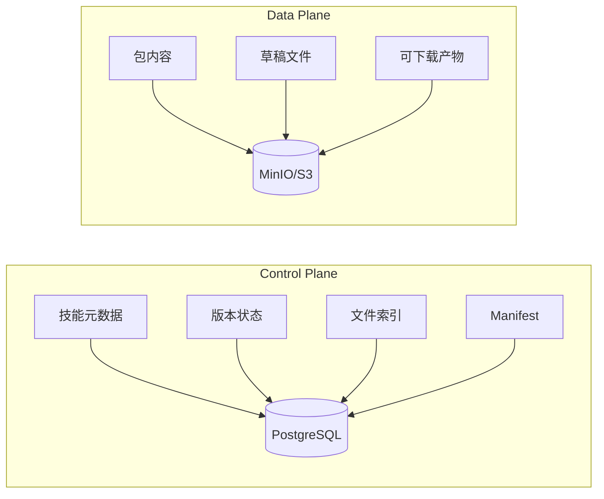

# Aisphere Hub

Aisphere Hub 是 AIHub 能力的**业务服务**，涵盖技能目录、技能版本、包存储、草稿工作区和分享工作流。

## 架构

```mermaid
flowchart TB
    subgraph "Hub 服务目录结构"
        API[api/<br/>Protobuf APIs + 生成代码]
        CMD[cmd/aisphere-hub/<br/>应用入口]
        CONF[configs/<br/>本地配置]
        MIG[migrations/postgres/<br/>数据库迁移]
        SVC[internal/service/<br/>Transport 服务层]
        BIZ[internal/biz/<br/>业务逻辑层]
        DATA[internal/data/<br/>数据访问层]
    end

    subgraph "存储"
        PG[(PostgreSQL<br/>Control Plane)]
        S3[(MinIO/S3<br/>Data Plane)]
    end

    SVC --> BIZ
    BIZ --> DATA
    DATA --> PG
    DATA --> S3
```



## 存储架构



## 主要端点

| 方法 | 路径 | 说明 |
|------|------|------|
| POST | `/v1/skills` | 创建技能 |
| GET | `/v1/skills` | 列出技能 |
| GET | `/v1/skills/{name}` | 获取技能详情 |
| PUT | `/v1/skills/{name}` | 更新技能 |
| DELETE | `/v1/skills/{name}` | 删除技能 |
| POST | `/v1/skills:upload` | 上传技能包 |
| GET | `/v1/skills/{name}/versions` | 列出版本 |
| GET | `/v1/skills/{name}/versions/{version}` | 获取版本详情 |
| POST | `/v1/skills/{name}/versions/{version}:submit` | 提交版本 |
| POST | `/v1/skills/{name}/versions/{version}:publish` | 发布版本 |
| POST | `/v1/skills/{name}/versions/{version}:online` | 上线版本 |
| POST | `/v1/skills/{name}/versions/{version}:offline` | 下线版本 |
| GET | `/v1/skills/{name}/versions/{version}/download` | 下载版本 |
| GET | `/v1/skills/{name}/versions/{version}/files` | 列出文件 |
| GET | `/v1/skills/{name}/draft/files` | 草稿文件列表 |
| PUT | `/v1/skills/{name}/draft/file` | 写入草稿文件 |
| POST | `/v1/skills/{name}/draft:commit` | 提交草稿 |
| POST | `/v1/skills/{name}/shares` | 创建分享 |
| DELETE | `/v1/skills/{name}/shares/{subject_type}/{subject_id}` | 删除分享 |

## 本地运行

```bash
go run ./cmd/aisphere-hub -conf ./configs
```

默认端口：

- HTTP: `0.0.0.0:18001`
- gRPC: `0.0.0.0:19001`

## 存储架构

- **PostgreSQL** — control plane：技能元数据、版本状态、文件索引、manifest
- **MinIO/S3** — data plane：包内容、草稿文件内容、大对象、可下载产物

## 生成

```bash
make tools
make api
make proto-check
```

## 验证

```bash
go mod tidy
go test ./...
make verify
```