# 权限模型设计

## 一、为什么选择 ReBAC？

### 1.1 传统 RBAC 的局限

传统基于角色的访问控制（RBAC）用「用户 → 角色 → 权限」的三层模型：

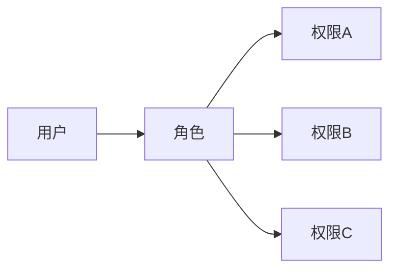

RBAC 的问题：

| 问题 | 场景 |
|------|------|
| 角色爆炸 | 每个资源类型都需要一套角色 |
| 无法表达层级 | 项目管理员应该自动拥有项目下所有资源的权限 |
| 无法表达关系 | "张三可以编辑李四创建的知识库"需要额外逻辑 |
| 跨资源授权 | "允许 A 团队的成员访问 B 项目" 需要额外代码 |

### 1.2 ReBAC 的解决思路

关系访问控制（ReBAC）用「资源 → 关系 → 主体」的模型：

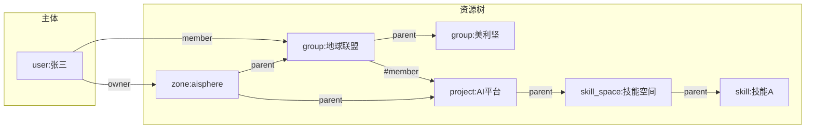

**核心思想**：权限不是直接赋予的，而是通过**关系链**推导出来的。

## 二、SpiceDB 核心概念

### 2.1 三个基本元素

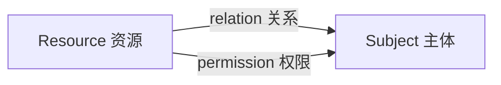

| 概念 | 说明 | 示例 |
|------|------|------|
| **Resource** | 被访问的对象 | `zone:aisphere`、`project:my-project` |
| **Subject** | 访问者 | `user:496333c7-...`、`group:team-a#member` |
| **Relation** | 资源与主体的关系 | `owner`、`admin`、`viewer` |
| **Permission** | 由关系推导出的访问能力 | `view`、`edit`、`manage` |

### 2.2 Schema 定义

Schema 是 SpiceDB 的「类型系统」，定义有哪些资源类型、关系和权限：

```zed
// 定义一个资源类型
definition zone {
    // 定义关系（谁可以关联到这个资源）
    relation owner: user | service | service_account | group#member
    relation admin: user | service | service_account | group#member
    relation group_viewer: user | service | service_account | group#member
    relation group_manager: user | service | service_account | group#member
    relation permission_admin: user | service | service_account | group#member

    // 定义权限（由关系推导）
    permission view_zone = owner + admin
    permission view_users = owner + admin + user_viewer + user_manager
    permission manage_users = owner + admin + user_manager
    permission view_groups = owner + admin + group_viewer + group_manager
    permission create_groups = owner + admin + group_manager
    permission manage_groups = owner + admin + group_manager
    permission view_permissions = owner + admin + permission_admin
    permission manage_permissions = owner + admin + permission_admin
}
```

### 2.3 Relation vs Permission

| | Relation（关系） | Permission（权限） |
|------|----------------|-------------------|
| **是什么** | 资源与主体的关联 | 由关系推导的访问能力 |
| **谁定义** | Schema 中定义 | Schema 中定义 |
| **谁写入** | 管理员通过 API 写入 | 系统自动计算 |
| **存储** | 持久化在 SpiceDB | 不存储，实时计算 |
| **类比** | Kubernetes RoleBinding | Kubernetes RBAC 检查结果 |

### 2.4 关系继承

SpiceDB 最强大的特性是关系可以跨资源类型继承：

```zed
definition group {
    relation parent: group
    relation zone: zone

    permission view = member + viewer + manager + owner
                  + zone->view_groups    // 从 zone 继承
                  + parent->view        // 从父组继承
}
```

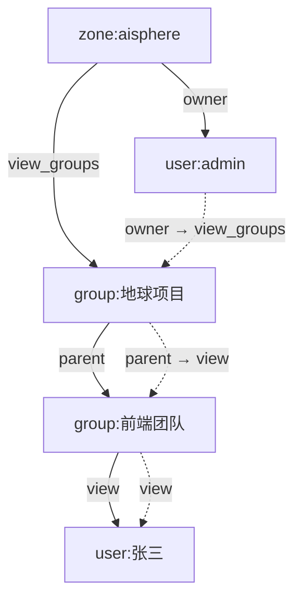

张三能查看前端团队，因为：
1. admin 是 zone 的 owner → zone 的 view_groups
2. 地球项目是 zone 的子资源 → 继承 view_groups
3. 前端团队是地球项目的子组 → 继承 view

## 三、Aisphere 权限模型设计

### 3.1 设计原则

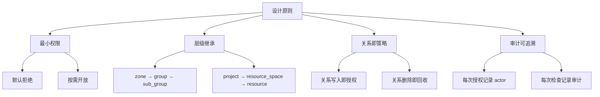

### 3.2 资源层级

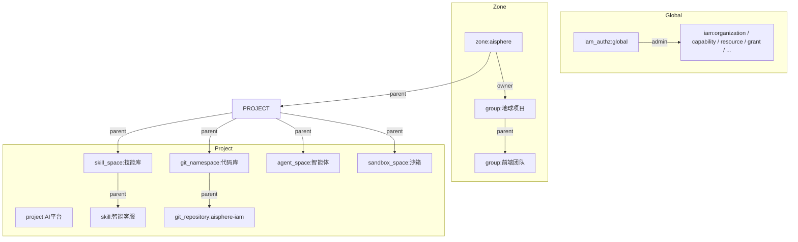

### 3.3 完整 Schema

```zed
// ─── 基础主体 ─────────────────────────────────────
definition user {}
definition service {}
definition service_account {}

// ─── 可用区（Zone） ──────────────────────────
// 对应 Casdoor Organization，是权限树的根节点
definition zone {
    relation owner: user | service | service_account | group#member
    relation admin: user | service | service_account | group#member
    relation user_viewer: user | service | service_account | group#member
    relation user_manager: user | service | service_account | group#member
    relation group_viewer: user | service | service_account | group#member
    relation group_manager: user | service | service_account | group#member
    relation permission_admin: user | service | service_account | group#member

    permission view_zone = owner + admin
    permission view_users = owner + admin + user_viewer + user_manager
    permission manage_users = owner + admin + user_manager
    permission view_groups = owner + admin + group_viewer + group_manager
    permission create_groups = owner + admin + group_manager
    permission manage_groups = owner + admin + group_manager
    permission view_permissions = owner + admin + permission_admin
    permission manage_permissions = owner + admin + permission_admin
}

// ── 用户组（Group） ─────────────────────────
// 支持多级树形结构，既是资源也是主体
definition group {
    relation zone: zone
    relation parent: group

    relation member: user | service | service_account | group#member
    relation owner: user | service | service_account | group#member
    relation manager: user | service | service_account | group#member
    relation viewer: user | service | service_account | group#member
    relation permission_admin: user | service | service_account | group#member

    permission view = member + viewer + manager + owner + zone->view_groups + parent->view
    permission manage = owner + manager + zone->manage_groups + parent->manage
    permission create_child_groups = owner + manager + zone->create_groups + parent->create_child_groups
    permission manage_members = owner + manager + zone->manage_users + parent->manage_members
    permission view_permissions = owner + permission_admin + zone->view_permissions + parent->view_permissions
    permission manage_permissions = owner + permission_admin + zone->manage_permissions + parent->manage_permissions
}

// ── 项目（Project） ─────────────────────────
definition project {
    relation parent: organization
    relation owner: user | group#member
    relation admin: user | group#member
    relation developer: user | group#member
    relation operator: user | group#member
    relation viewer: user | group#member

    permission manage = owner + admin + parent->manage
    permission write = manage + developer
    permission operate = manage + operator
    permission read = write + operate + viewer + parent->view
}

// ── 技能（Skill） ───────────────────────────
definition skill {
    relation parent: skill_space
    relation owner: user | group#member
    relation editor: user | group#member
    relation reviewer: user | group#member
    relation viewer: user | group#member

    permission manage = owner + parent->manage
    permission edit = manage + editor + parent->edit
    permission review = manage + reviewer
    permission publish = manage + reviewer
    permission view = edit + viewer + parent->view
}
```

### 3.4 关系 vs 权限映射

| 业务角色 | SpiceDB Relation | 派生权限 |
|----------|-----------------|---------|
| 所有者 | `owner` | 所有权限 |
| 管理员 | `admin` | 管理权限 |
| 编辑者 | `editor` | 读写权限 |
| 查看者 | `viewer` | 只读权限 |
| 执行者 | `executor` | 执行权限 |
| 操作者 | `operator` | 操作权限 |

### 3.5 权限继承链

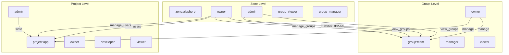

## 四、关系管理

### 4.1 写入关系

```go
// IAM 后端写入关系
func (s *IAMAuthorizationAdminService) WriteRelationships(ctx context.Context, req *v1.WriteRelationshipsRequest) (*v1.WriteRelationshipsReply, error) {
    principal, ok := authn.PrincipalFromContext(ctx)
    // ... 权限检查 ...

    relationships := make([]authz.Relationship, len(req.GetRelationships()))
    for i, r := range req.GetRelationships() {
        relationships[i] = authz.Relationship{
            Resource: authz.ObjectRef{Type: r.GetResource().GetType(), ID: r.GetResource().GetId()},
            Relation: r.GetRelation(),
            Subject:  authz.SubjectRef{Type: r.GetSubject().GetType(), ID: r.GetSubject().GetId()},
        }
    }
    return s.deps.AuthzAdmin.WriteRelationships(ctx, relationships...)
}
```

### 4.2 检查权限

```text
// IAM 后端检查权限
func (s *IAMDirectoryService) requireZonePermission(ctx context.Context, orgID string, permission string) error {
    principal, ok := authn.PrincipalFromContext(ctx)
    // ...
    decision, err := s.deps.Authz.Check(ctx, authz.CheckRequest{
        Subject:    authz.SubjectRef{Type: "user", ID: principal.SubjectID},
        Resource:   authz.ObjectRef{Type: "zone", ID: orgID},
        Permission: permission,
    })
    if !decision.IsAllowed() {
        return authz.ErrPermissionDenied(...)
    }
    return nil
}
```

### 4.3 前端授权

前端通过 IAM API 进行权限检查：

```typescript
// 前端检查当前用户是否有某个权限
const { data } = useIamCheckAuthzPermission({
    subject: { type: 'user', id: principal.subjectId },
    resource: { type: 'zone', id: 'aisphere' },
    permission: 'view_groups',
});
```

## 五、业务场景示例

### 5.1 场景：团队管理

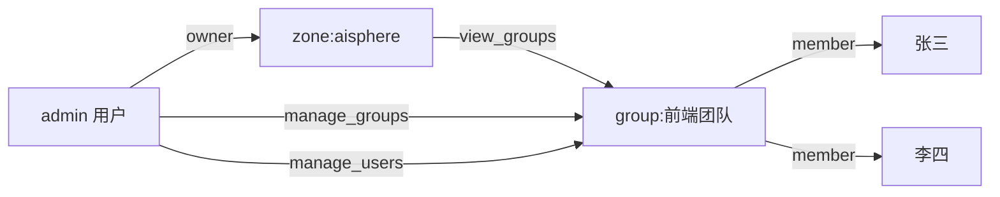

1. admin 是 zone 的 owner → 拥有所有权限
2. admin 创建 group:前端团队
3. admin 把张三、李四设为 group 的 member
4. 张三、李四通过 `group#member` 获得 group 的 view 权限

### 5.2 场景二：项目协作

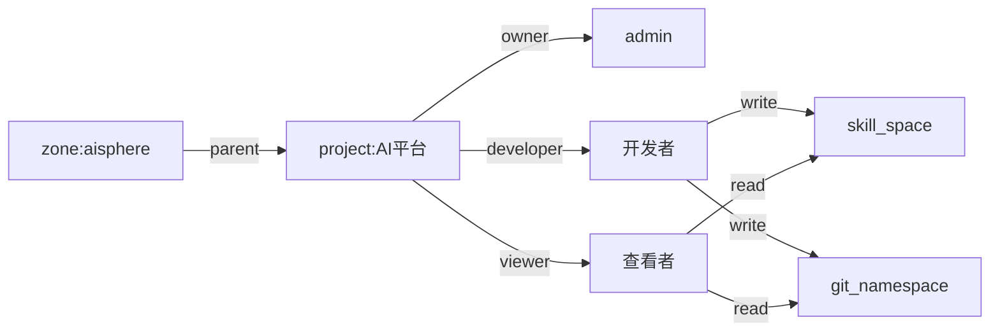

1. admin 创建 project:AI平台
2. admin 把开发者设为 developer，查看者设为 viewer
3. developer 可以创建/编辑 skill 和 git 仓库
4. viewer 只能查看

### 5.3 场景：跨团队授权

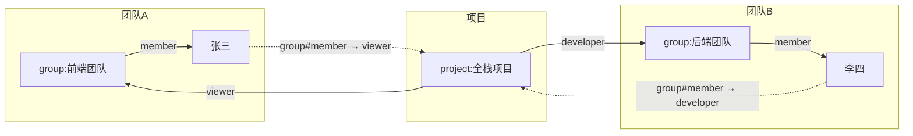

## 六、前端权限管理页面

### 6.1 页面结构

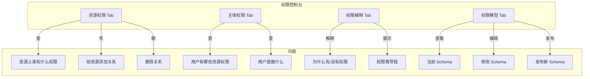

### 6.2 资源权限 Tab

```typescript
// 前端查询资源上的关系
const { data } = useIamAuthzRelationships({
    resourceType: 'zone',
    resourceId: 'aisphere',
});

// 展示结果
<Table>
  <TableRow>
    <TableCell>主体</TableCell>
    <TableCell>关系</TableCell>
    <TableCell>操作</TableCell>
  </TableRow>
  <TableRow>
    <TableCell>user:496333c7-...</TableCell>
    <TableCell>owner</TableCell>
    <TableCell><Button>删除</Button></TableCell>
  </TableRow>
</Table>
```

## 七、设计决策

### 7.1 为什么用 ReBAC 而不是 RBAC？

| 维度 | RBAC | ReBAC（SpiceDB） |
|------|------|-----------------|
| 模型 | 用户 → 角色 → 权限 | 资源 → 关系 → 主体 |
| 层级 | 扁平 | 树形继承 |
| 跨资源 | 需要额外代码 | 原生支持 |
| 粒度 | 角色级别 | 资源级别 |
| 复杂度 | 低 | 中 |
| 适用场景 | 简单管理后台 | 复杂多租户系统 |

### 7.2 为什么用 SpiceDB 而不是 Casbin？

| 维度 | Casbin | SpiceDB |
|------|--------|---------|
| 模型 | RBAC/ABAC | ReBAC |
| 存储 | 自建 | 专用数据库 |
| 一致性 | 最终 | 强一致（Zanzibar） |
| 性能 | 内存计算 | 分布式缓存 |
| 继承 | 手动实现 | 原生支持 |
| 审计 | 手动 | 内置变更日志 |

### 7.3 为什么 zone 的 owner 拥有所有权限？

```zed
permission view_users = owner + admin + user_viewer + user_manager
permission manage_users = owner + admin + user_manager
permission view_groups = owner + admin + group_viewer + group_manager
permission manage_groups = owner + admin + group_manager
```

owner 拥有所有权限，因为：
1. **简化管理**：zone 的 owner 通常是平台管理员
2. **避免权限不足**：owner 不会因为缺少某个细分权限而无法操作
3. **符合直觉**：资源的所有者应该能做任何事

### 7.4 为什么 group 支持嵌套？

```zed
definition group {
    relation parent: group
    permission view = ... + parent->view
}
```

因为：
1. **组织架构**：公司有部门 → 团队 → 小组的层级
2. **权限继承**：部门管理员自动拥有下属团队的权限
3. **Casdoor 对齐**：Casdoor Group 本身就支持 parentId

## 八、验证

### 8.1 检查权限

```bash
# 检查 admin 用户是否有 zone:aisphere 的 view_groups 权限
grpcurl -plaintext -d '{
  "resource": {"objectType": "zone", "objectId": "aisphere"},
  "permission": "view_groups",
  "subject": {"object": {"objectType": "user", "objectId": "496333c7-..."}}
}' 36.137.200.194:30084 authzed.api.v1.PermissionsService/CheckPermission
```

### 8.2 查看关系

```bash
# 查看 zone:aisphere 的所有关系
curl -s -X POST "http://36.137.200.194:30087/v1/relationships/read" \
  -H "Content-Type: application/json" \
  -H "Authorization: Bearer keykeykey" \
  -d '{"relationshipFilter":{"resourceType":"zone","resourceId":"aisphere"}}'
```

### 8.3 查看 Schema

```bash
# 查看当前 Schema
curl -s -X POST "http://36.137.200.194:30087/v1/schema/read" \
  -H "Content-Type: application/json" \
  -H "Authorization: Bearer keykeykey"
```

## 九、相关代码

| 文件 | 说明 |
|------|------|
| `configs/spicedb/aisphere.schema.zed` | SpiceDB Schema 定义 |
| `internal/service/authz_admin.go` | 授权管理服务 |
| `internal/service/iam.go` | 权限检查服务 |
| `internal/data/data.go` | 数据层初始化 |
| `internal/server/access.go` | 安全中间件配置 |
| `src/components/pages/permissions-page.tsx` | 前端权限控制台 |
| `src/lib/authz/schema-summary.ts` | Schema 解析工具 |