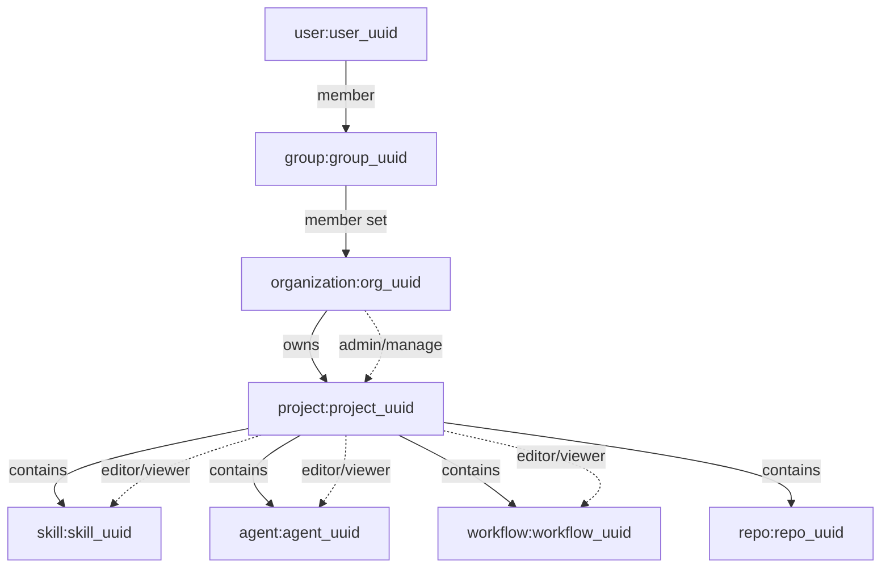
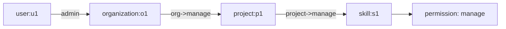
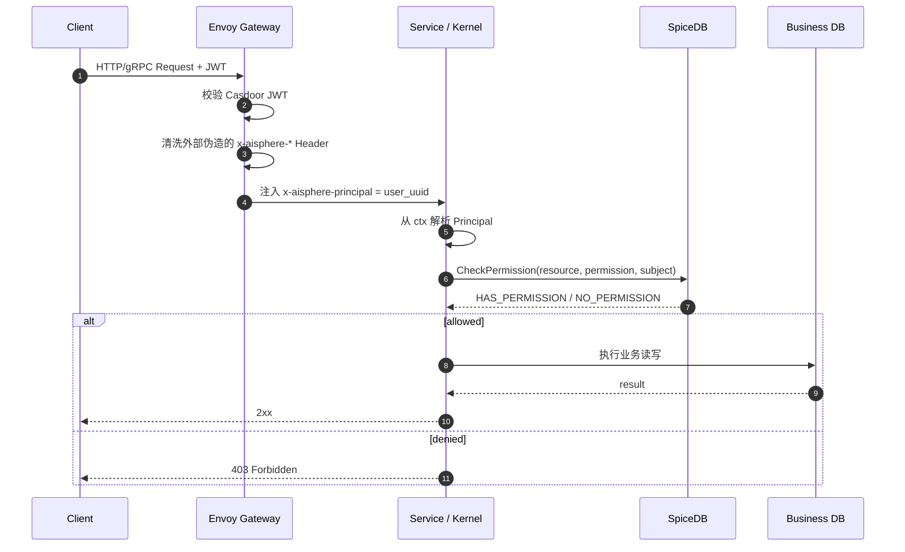
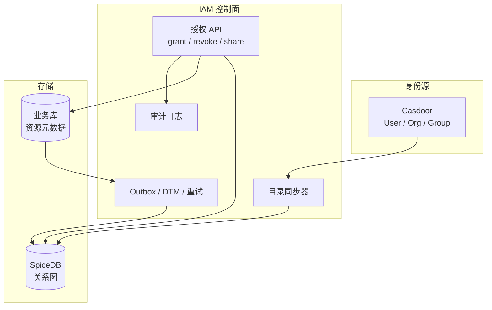
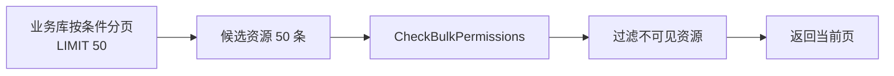
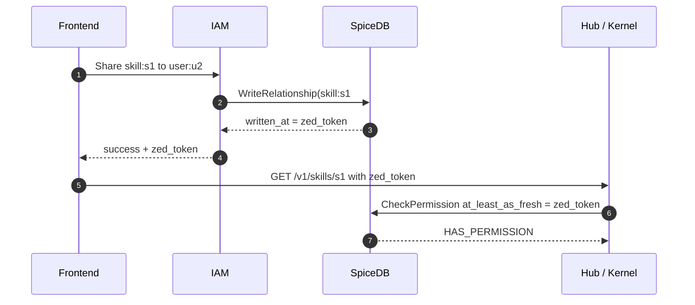
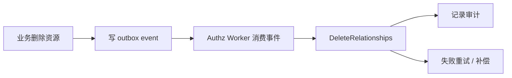

# ReBAC 与 SpiceDB 权限模型

本文解释 Aisphere IAM 中的 ReBAC 权限模型，以及如何用 SpiceDB 管理 `organization / project / skill / agent / workflow / repo` 等资源的访问控制。

目标是形成一套清晰边界：

- **Casdoor**：负责 AuthN，管理用户、组织、组、登录和 OIDC/JWT。
- **IAM**：负责权限控制面，管理关系写入、同步、审计、补偿和聚合 API。
- **SpiceDB**：负责 AuthZ，保存关系图并计算权限。
- **Gateway / Kernel**：负责权限执行面，在请求链路中完成 principal 注入和 `CheckPermission`。


## 1. ReBAC 是什么

**ReBAC** 是 Relationship-Based Access Control，即**基于关系的访问控制**。

它不是先判断用户有没有某个全局角色，而是判断：

> 某个主体和某个资源之间，能不能通过关系图推导出某个业务权限。

例如：

```text
user:u1 是 group:g_dev 的 member
group:g_dev 是 project:p1 的 editor
skill:s1 属于 project:p1
```

当系统检查：

```text
user:u1 能不能 edit skill:s1 ?
```

SpiceDB 会沿着关系图计算：

```text
user:u1 -> group:g_dev#member -> project:p1#editor -> skill:s1#project -> edit
```

如果 schema 允许从 `project editor` 继承到 `skill edit`，则返回允许。

## 2. ReBAC、RBAC、ABAC 的区别

| 模型 | 判断依据 | 适合场景 | 典型问题 |
|---|---|---|---|
| RBAC | 用户是否拥有某个角色 | 简单后台、全局角色 | 容易角色爆炸，难表达资源层级 |
| ABAC | 用户、资源、请求上下文属性 | IP、时间、部门、环境等动态条件 | 复杂资源关系难维护 |
| ReBAC | 主体和资源之间的关系路径 | 组织、项目、组、资源、分享、继承 | 需要先设计好关系图 |

Aisphere 的核心对象天然具有层级和关系：

```text
user / group / organization / project / skill / agent / workflow / repo
```

所以资源级授权应以 ReBAC 为主，RBAC 只保留少量平台级能力，ABAC 作为动态条件补充。

## 3. SpiceDB 的 4 个核心概念

```mermaid
flowchart LR
    Resource[Resource / Object<br/>被保护的资源] --> Relation[Relation<br/>保存进去的事实关系]
    Subject[Subject<br/>访问主体] --> Relation
    Relation --> Permission[Permission<br/>计算出来的业务动作]
    Permission --> Check[CheckPermission<br/>请求时检查]

    Resource -. 示例 .-> R1[skill:skill_001]
    Subject -. 示例 .-> S1[user:user_001]
    Relation -. 示例 .-> REL[skill:skill_001#owner@user:user_001]
    Permission -. 示例 .-> P1[view / edit / delete]
```

### 3.1 Resource / Object：资源对象

Resource 是被保护的东西。在 SpiceDB 中通常称为 object。

| 业务资源 | SpiceDB object |
|---|---|
| 组织 | `organization:org_uuid` |
| 项目 | `project:project_uuid` |
| Skill | `skill:skill_uuid` |
| Agent | `agent:agent_uuid` |
| Workflow | `workflow:workflow_uuid` |
| Git Repo | `repo:repo_uuid` |
| Secret | `secret:secret_uuid` |

SpiceDB 不保存资源详情。`skill:skill_001` 只是权限图里的一个节点，Skill 的名称、YAML、版本、描述、状态仍然放在业务库、Git 或对象存储中。

### 3.2 Subject：主体

Subject 是访问资源的一方。

| 主体类型 | SpiceDB subject | 说明 |
|---|---|---|
| 用户 | `user:user_uuid` | 从 Casdoor 稳定 UUID 获取 |
| 服务账号 | `serviceaccount:iam` | IAM、Hub、Gateway、同步任务等 M2M |
| 用户组成员集合 | `group:group_uuid#member` | 一个组的所有成员 |
| 组织成员集合 | `organization:org_uuid#member` | 一个组织的所有成员 |

重要约束：**用户主体统一使用稳定 UUID，不使用 name、email、displayName、phone。**

推荐：

```text
user:4d36f0a2-7c0d-4cb5-a84f-4c6c6fbf0c70
```

不推荐：

```text
user:alice@example.com
user:alice
user:张三
```

### 3.3 Relation：关系

Relation 是写入 SpiceDB 的**事实**。

例如：

```text
skill:skill_001#owner@user:user_001
skill:skill_001#viewer@user:user_002
skill:skill_001#editor@group:g_dev#member
```

可以读作：

```text
user_001 是 skill_001 的 owner
user_002 是 skill_001 的 viewer
g_dev 组内所有 member 都是 skill_001 的 editor
```

Relation 是权限图里的边。它表示已经发生或被授权的关系事实。

### 3.4 Permission：权限

Permission 是 schema 中定义的**业务动作**，通常是应用代码真正检查的内容。

例如：

```text
definition skill {
  relation owner: user
  relation editor: user
  relation viewer: user

  permission view = viewer + editor + owner
  permission edit = editor + owner
  permission delete = owner
}
```

业务代码应该检查：

```text
skill:skill_001#edit@user:user_001
```

而不是直接检查：

```text
skill:skill_001#owner@user:user_001
```

原因是：

- `owner / editor / viewer` 是底层关系事实。
- `view / edit / delete / manage / run / share` 是业务动作。
- 业务代码稳定检查 permission，后续只改 schema 即可调整权限策略。

## 4. Relation 和 Permission 的边界

这是最容易混淆的点。

| 类型 | 是什么 | 是否直接写入 | 是否业务检查 | 示例 |
|---|---|---:|---:|---|
| Relation | 事实关系 | 是 | 一般不直接查 | `skill:s1#owner@user:u1` |
| Permission | 动作能力 | 否，由 schema 计算 | 是 | `skill:s1#delete@user:u1` |

关系事实：

```text
skill:s1#owner@user:u1
```

权限推导：

```text
permission view = viewer + editor + owner
permission edit = editor + owner
permission delete = owner
```

检查结果：

```text
user:u1 has skill:s1#view
user:u1 has skill:s1#edit
user:u1 has skill:s1#delete
```

## 5. SpiceDB Schema 基础

Schema 是权限图的类型系统。

一个最小 Skill schema：

```text
definition user {}

definition skill {
  relation owner: user
  relation editor: user
  relation viewer: user

  permission view = viewer + editor + owner
  permission edit = editor + owner
  permission delete = owner
}
```

### 5.1 常用操作符

| 操作符 | 含义 | 示例 |
|---|---|---|
| `+` | 并集，任意满足即可 | `view = viewer + editor + owner` |
| `&` | 交集，必须同时满足 | `approve = reviewer & project->member` |
| `-` | 排除 | `view = viewer - banned` |
| `->` | 关系跳转，沿资源关系继续计算 | `view = project->view + viewer` |

其中 `->` 是 ReBAC 建模的关键，它让权限可以沿着资源关系图继承。

## 6. 资源层级和权限继承

Aisphere 推荐先抽象出这条资源主线：



推荐 schema 起点：

```text
definition user {}

definition serviceaccount {}

definition group {
  relation member: user | group#member
}

definition organization {
  relation admin: user | group#member | serviceaccount
  relation member: user | group#member | serviceaccount

  permission view = member + admin
  permission manage = admin
  permission create_project = admin
}

definition project {
  relation org: organization

  relation owner: user | group#member | serviceaccount
  relation editor: user | group#member | serviceaccount
  relation viewer: user | group#member | serviceaccount

  permission view = viewer + editor + owner + org->view
  permission edit = editor + owner
  permission manage = owner + org->manage
  permission create_skill = edit + manage
  permission create_agent = edit + manage
  permission create_workflow = edit + manage
}

definition skill {
  relation project: project

  relation owner: user | group#member | serviceaccount
  relation editor: user | group#member | serviceaccount
  relation viewer: user | group#member | serviceaccount

  permission view = viewer + editor + owner + project->view
  permission edit = editor + owner + project->edit
  permission manage = owner + project->manage
  permission delete = owner + project->manage
}
```

:::caution
`permission view = project->view` 会让项目可见性继承到 Skill。也就是说，能看项目的人默认能看项目下的 Skill。这个策略是否正确取决于业务语义。若 Skill 需要更细粒度隔离，则不要默认继承项目 view，只继承 manage 或显式授权。
:::

## 7. 权限推导示例

关系数据：

```text
organization:o1#admin@user:u1
project:p1#org@organization:o1
skill:s1#project@project:p1
```

schema：

```text
definition organization {
  relation admin: user
  permission manage = admin
}

definition project {
  relation org: organization
  relation owner: user
  permission manage = owner + org->manage
}

definition skill {
  relation project: project
  relation owner: user
  permission manage = owner + project->manage
}
```

检查：

```text
Can user:u1 manage skill:s1 ?
```

推导路径：



结果：

```text
HAS_PERMISSION
```

原因：

```text
user:u1 是 organization:o1 的 admin
project:p1 属于 organization:o1
skill:s1 属于 project:p1
organization admin 可以 manage project
project manage 可以 manage skill
```

## 8. Aisphere 推荐建模规范

### 8.1 Object type 命名

| 类型 | 说明 |
|---|---|
| `user` | Casdoor 用户 |
| `serviceaccount` | 服务账号 / M2M 主体 |
| `group` | 用户组，可支持嵌套 |
| `organization` | 租户根对象 |
| `project` | 组织下的项目边界 |
| `skill` | Skill 资源 |
| `agent` | Agent 资源 |
| `workflow` | Workflow 资源 |
| `repo` | Git 仓库资源 |
| `secret` | 密钥资源 |
| `runtime` | Runtime / Sandbox 资源 |

### 8.2 Relation 用名词

Relation 表示关系事实，推荐用名词：

```text
owner
editor
viewer
admin
member
parent
org
project
creator
runner
approver
```

### 8.3 Permission 用动作

Permission 表示业务动作，推荐用动词或动作名：

```text
view
edit
delete
manage
share
run
publish
clone
create_skill
create_agent
create_workflow
read_secret
write_secret
```

### 8.4 应用代码只检查 Permission

| API | SpiceDB Check |
|---|---|
| `GET /v1/projects/{id}` | `project:{id}#view@user:{uid}` |
| `PUT /v1/projects/{id}` | `project:{id}#edit@user:{uid}` |
| `DELETE /v1/projects/{id}` | `project:{id}#manage@user:{uid}` |
| `POST /v1/projects/{id}/skills` | `project:{id}#create_skill@user:{uid}` |
| `GET /v1/skills/{id}` | `skill:{id}#view@user:{uid}` |
| `PUT /v1/skills/{id}` | `skill:{id}#edit@user:{uid}` |
| `DELETE /v1/skills/{id}` | `skill:{id}#delete@user:{uid}` |
| `POST /v1/workflows/{id}/run` | `workflow:{id}#run@user:{uid}` |

## 9. 关系写入生命周期

### 9.1 创建组织

业务库写入：

```text
organization {
  id = org_001
  name = "Aisphere"
  created_by = user_001
}
```

SpiceDB 写入：

```text
organization:org_001#admin@user:user_001
organization:org_001#member@user:user_001
```

### 9.2 创建项目

业务库写入：

```text
project {
  id = project_001
  org_id = org_001
  created_by = user_001
}
```

SpiceDB 写入：

```text
project:project_001#org@organization:org_001
project:project_001#owner@user:user_001
```

### 9.3 创建 Skill

业务库写入：

```text
skill {
  id = skill_001
  project_id = project_001
  created_by = user_001
}
```

SpiceDB 写入：

```text
skill:skill_001#project@project:project_001
skill:skill_001#owner@user:user_001
```

### 9.4 授权给用户组

组成员关系：

```text
group:g_dev#member@user:user_002
group:g_dev#member@user:user_003
```

资源授权：

```text
skill:skill_001#editor@group:g_dev#member
```

含义：

```text
g_dev 组内所有成员都是 skill_001 的 editor
```

## 10. 请求链路



Kernel 侧推荐通过 `protoc option` 声明权限：

```text
rpc UpdateSkill(UpdateSkillRequest) returns (Skill) {
  option (google.api.http) = {
    put: "/v1/skills/{id}"
    body: "*"
  };

  option (aisphere.authz) = {
    resource_type: "skill"
    resource_id_field: "id"
    permission: "edit"
  };
}
```

生成代码负责：

```text
principal := contextx.Principal(ctx)
resourceID := req.Id
CheckPermission(skill:resourceID, edit, user:principal.ID)
```

业务代码只关注业务逻辑，不重复手写权限判断。

## 11. 管理链路



建议边界：

| 组件 | 职责 |
|---|---|
| Casdoor | 用户、组织、组、登录、OIDC |
| IAM | 关系管理 API、同步 Casdoor、审计、补偿、权限聚合 |
| SpiceDB | 保存 relationship，执行 Check / Lookup |
| Hub / Runtime / Gateway | 调用 IAM 或 Kernel Guard，不直接随意写 SpiceDB |

## 12. 列表接口怎么做

`GET /v1/skills` 这类接口不能简单把所有资源查出来再返回，需要做权限过滤。

### 12.1 小规模列表：LookupResources

```mermaid
flowchart LR
    A[subject=user:u1] --> B[LookupResources<br/>permission=view<br/>resource_type=skill]
    B --> C[skill id list]
    C --> D[SELECT * FROM skills WHERE id IN (...)]
    D --> E[返回可见列表]
```

适合：

- 用户可见资源数量不大。
- 管理后台页面。
- 授权结果比业务排序更重要。

### 12.2 常规分页：业务库分页 + CheckBulk



适合：

- 常规产品列表。
- 有明确 `org_id / project_id` 范围。
- 需要按照创建时间、更新时间、名称等业务字段排序。

### 12.3 大规模列表：权限索引

当资源量非常大时，可以增加 materialized ACL 或搜索索引：

```text
业务库查询 + CheckBulk 保证正确性
搜索索引 / ACL 表提升性能
SpiceDB 仍作为最终授权真源
```

## 13. 公开接口和公开资源

这两个概念必须分开。

### 13.1 公开接口

例如：

```text
/healthz
/readyz
/openapi.json
/oauth2/callback
/login
/public/assets/*
```

这些接口不需要登录，属于 AuthN/AuthZ bypass。它们应该由 Gateway 或 Kernel route 元数据标记为 public。

### 13.2 公开资源

例如：

```text
某个 Skill 公开可查看
某个 Agent 模板公开可 clone
某个 Workflow 示例公开可运行
```

这不是接口公开，而是资源本身授权给公共主体。

可以建模为：

```text
definition skill {
  relation public_viewer: user:*
  relation owner: user
  relation editor: user
  relation viewer: user

  permission view = public_viewer + viewer + editor + owner
}
```

推荐约束：

- 默认不公开，显式设置 public 才公开。
- 公开资源只开放 `view / clone` 等安全动作。
- 不允许公开主体获得 `edit / manage / delete`。
- public 关系必须可审计、可撤销。

## 14. 一致性与 ZedToken

SpiceDB 写入关系后，会返回用于一致性控制的 token。对“写完马上读”的场景，应该把该 token 传递给后续检查，保证结果至少包含刚刚完成的写入。

典型场景：



Kernel 封装建议：

```text
type AuthzWriteResult struct {
    ZedToken string
}

type CheckOptions struct {
    AtLeastAsFresh string
}
```

## 15. 删除资源时清理关系

删除资源不能只删业务库。

例如删除 Skill：

```text
DELETE FROM skills WHERE id = skill_001
```

还需要删除 SpiceDB 中相关关系：

```text
skill:skill_001#project@project:project_001
skill:skill_001#owner@user:user_001
skill:skill_001#editor@...
skill:skill_001#viewer@...
```

推荐流程：



如果不清理，`LookupResources` 可能返回业务库已经不存在的资源 ID，形成幽灵权限。

## 16. Caveat：条件化关系

Caveat 可以理解为：

> 这条关系存在，但只有在运行时上下文满足条件时才成立。

可用于：

| 场景 | 示例 |
|---|---|
| 临时分享 | 分享 24 小时后自动失效 |
| IP 限制 | 只允许内网 CIDR 访问 |
| 环境限制 | 只允许 dev/test/prod 某个环境 |
| Runtime 限制 | 只允许某个 service account 执行 |

示意：

```text
skill:s1#viewer@user:u2 with expires_at(timestamp = "2026-07-10T00:00:00Z")
```

建议前期少用 Caveat。先把核心资源关系建稳，再引入动态条件。

## 17. Fail Closed 原则

权限模型必须默认拒绝。

推荐：

```text
permission view = viewer + editor + owner
```

不推荐：

```text
permission view = public - blocked
```

原因：如果 `blocked` 关系写入失败，用户反而可能获得访问权限。

Aisphere 权限设计原则：

```text
没有显式关系，就没有权限。
有权限必须能解释路径。
权限变更必须可审计。
资源删除必须清理关系。
业务代码检查 permission，不检查 relation。
```

## 18. IAM API 建议

### 18.1 权限检查

```text
POST /v1/iam/permissions/check
```

请求：

```json
{
  "resource_type": "skill",
  "resource_id": "skill_001",
  "permission": "edit",
  "subject_type": "user",
  "subject_id": "user_001"
}
```

响应：

```json
{
  "allowed": true,
  "decision_id": "dec_01J...",
  "zed_token": "..."
}
```

### 18.2 授权

```text
POST /v1/iam/relationships/grant
```

请求：

```json
{
  "resource_type": "skill",
  "resource_id": "skill_001",
  "relation": "editor",
  "subject_type": "group",
  "subject_id": "g_dev",
  "subject_relation": "member"
}
```

写入：

```text
skill:skill_001#editor@group:g_dev#member
```

### 18.3 撤销授权

```text
POST /v1/iam/relationships/revoke
```

请求：

```json
{
  "resource_type": "skill",
  "resource_id": "skill_001",
  "relation": "editor",
  "subject_type": "group",
  "subject_id": "g_dev",
  "subject_relation": "member"
}
```

删除：

```text
skill:skill_001#editor@group:g_dev#member
```

## 19. Schema 变更管理

SpiceDB schema 应像数据库 migration 一样管理。

推荐目录：

```text
spicedb/
  schema/
    001_init.zed
    002_add_workflow.zed
    003_add_repo.zed
  tests/
    organization_test.yaml
    project_test.yaml
    skill_test.yaml
```

流程：


注意顺序：

1. 先部署兼容性 schema。
2. 再部署写入新 relationship 的业务代码。
3. 最后启用依赖新 permission 的检查逻辑。

## 20. 可观测性与审计

每次权限检查建议记录：

| 字段 | 说明 |
|---|---|
| `request_id` | 请求 ID |
| `trace_id` | 链路追踪 ID |
| `decision_id` | 权限决策 ID |
| `principal_type` | `user` 或 `serviceaccount` |
| `principal_id` | 稳定 UUID |
| `resource_type` | 资源类型 |
| `resource_id` | 资源 ID |
| `permission` | 检查的业务动作 |
| `allowed` | 是否允许 |
| `reason` | 拒绝原因或推导摘要 |
| `zed_token` | 一致性 token |

拒绝日志示例：

```json
{
  "level": "warn",
  "message": "permission denied",
  "request_id": "req_01J...",
  "decision_id": "dec_01J...",
  "principal_type": "user",
  "principal_id": "user_001",
  "resource_type": "skill",
  "resource_id": "skill_001",
  "permission": "edit",
  "allowed": false
}
```

## 21. 常见踩坑

### 21.1 把 Casdoor role 当资源权限

不推荐：

```text
role_aihub_admin = 可以管理所有 Skill
```

推荐：

```text
organization:o1#admin@user:u1
project:p1#owner@user:u1
skill:s1#editor@group:g1#member
```

Casdoor role 可以保留做少量平台级能力，例如是否允许进入控制台、是否为平台超级管理员。业务资源权限交给 SpiceDB。

### 21.2 业务代码检查 relation

不推荐：

```text
Check skill:s1#owner@user:u1
```

推荐：

```text
Check skill:s1#delete@user:u1
```

这样以后 `delete` 可以从 `owner` 扩展为 `owner + project->manage`，业务代码不需要改。

### 21.3 双写不一致

问题：

```text
PG 创建 skill 成功
SpiceDB 写 owner 失败
创建者看不到自己创建的 skill
```

解决：

```text
PG transaction + outbox
DTM / Saga
重试队列
补偿任务
定期一致性扫描
```

### 21.4 权限继承过大

例如：

```text
permission view = project->view
```

表示能看项目的人默认能看项目下所有 Skill。这个策略必须经过业务确认。

### 21.5 忘记清理 relationship

删除资源必须清理关系，否则会出现幽灵权限和脏 Lookup 结果。

## 22. 一页速查

| 问题 | 建模方式 |
|---|---|
| 保护什么？ | `resource_type:resource_id` |
| 谁访问？ | `subject_type:subject_id` |
| 写入什么事实？ | `resource#relation@subject` |
| 检查什么动作？ | `resource#permission@subject` |
| 用户 ID 用什么？ | Casdoor 稳定 UUID |
| 资源详情放哪？ | 业务库 / Git / S3 / PG |
| 权限关系放哪？ | SpiceDB |
| 谁写 SpiceDB？ | IAM 控制面和受控业务 outbox |
| 谁执行检查？ | Kernel Guard / Gateway / 服务中间件 |
| 列表怎么查？ | LookupResources 或业务分页 + CheckBulk |

最终原则：

```text
Casdoor 管身份
IAM 管关系
SpiceDB 算权限
Kernel / Gateway 执行权限
业务代码检查 permission
关系变更必须审计和补偿
```

## 参考资料

- [SpiceDB 官方文档](https://authzed.com/docs/spicedb)
- [SpiceDB Schema 概念](https://authzed.com/docs/spicedb/concepts/schema)
- [SpiceDB Relationships](https://authzed.com/docs/spicedb/concepts/relationships)
- [SpiceDB Querying Data](https://authzed.com/docs/spicedb/concepts/querying-data)
- [SpiceDB Read-after-Write](https://authzed.com/docs/spicedb/concepts/read-after-write)
- [SpiceDB Caveats](https://authzed.com/docs/spicedb/concepts/caveats)
