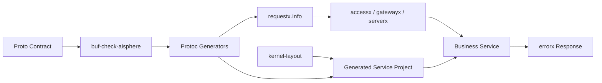

# Aisphere Kernel

Aisphere Kernel 是 Aisphere 项目的**规范驱动微服务基础框架**。

## 核心理念



业务声明契约，Kernel 负责检查、生成、装配、治理和验证。业务项目优先写 proto contract 和领域逻辑，不手写 transport glue、错误协议转换、访问控制、审计、限流或 Gateway 分发 glue。

## 仓库边界

Kernel 仓库现在只维护以下内容：

- runtime packages：`errorx`、`serverx`、`accessx`、`authn`、`authz`、`gatewayx` 等；
- proto options、公共契约和契约检查器；
- `cmd/protoc-gen-*` 代码生成器；
- `cmd/kernel` CLI 的 layout 解析和项目创建行为。

生成服务模板、生成服务 Makefile、deploy manifest 模板、layout 文档和 layout smoke tests 已归属独立仓库：

```text
https://github.com/aisphereio/kernel-layout
```

`validation/` 已从 Kernel runtime tree 移除。后续场景验证应放到独立验证仓库、生成项目自己的 tests，或 CI 中临时生成测试工程。

## 快速开始

创建业务服务：

```bash
go install github.com/aisphereio/kernel/cmd/kernel@latest
kernel new todo-service
cd todo-service
make tools
make api
make deploy
make proto-check
make verify
make run
```

说明：这里的 `make deploy` 是**生成服务项目**的 Makefile 能力，由 `kernel-layout` 提供；不是 Kernel 仓库根目录的 target。

Kernel 仓库自身验证：

```bash
make tools
make api
make proto-check
make verify
```

最小可运行服务：

```bash
kernel new todo-service --mvp
```

裁剪能力：

```bash
kernel new todo-service --disable iam,gateway,dtmx
```

本地或私有 layout：

```bash
kernel new todo-service --repo /path/to/kernel-layout
# 或
KERNEL_LAYOUT=/path/to/kernel-layout kernel new todo-service
```

默认解析顺序：

```text
--repo -> KERNEL_LAYOUT -> https://github.com/aisphereio/kernel-layout.git
```

## Runtime API

业务代码和生成代码可以 import 的主线 runtime 包：

| 包 | 说明 |
|---|---|
| `errorx` | 结构化错误处理 |
| `logx` | 结构化日志 |
| `configx` | 配置管理 |
| `metricsx` | 指标收集 |
| `serverx` | 一键服务装配 |
| `securityx` | 安全配置和 provider-neutral runtime 构造 |
| `bootx` | 启动治理校验 |
| `transportx/http` | HTTP transport |
| `transportx/grpc` | gRPC transport |
| `requestx` | 请求元信息中心 |
| `accessx` | request-time access guard；编排 authn + authz + audit + SkipPolicy |
| `authn` | 认证 provider contract：回答“调用者是谁” |
| `authz` | 授权 provider contract：回答“能不能访问资源” |
| `auditx` | 审计事实记录 |
| `gatewayx` | Gateway runtime |
| `admissionx` | 准入插件链 |
| `ratelimitx` | 限流 |
| `clientpolicyx` | 服务间调用策略 |
| `dbx` | 数据库 |
| `cachex` | 缓存 |
| `objectstorex` | 对象存储 |
| `dtmx` | 分布式事务 |
| `selectorx` | 服务选择 |
| `registry` | 服务注册发现 |
| `encodingx` | 编码 |
| `iamx` | Kernel IAM 控制面模型和 Directory facade |
| `resourcex` | 资源、角色模板和 Grant 控制面事实 |

## 关键边界

| 易混点 | 结论 |
|---|---|
| `authz` vs `accessx` | `authz` 是 provider contract；`accessx` 是 request-time guard/orchestrator |
| `authn.IdentityAdmin` vs `iamx.Directory` | `IdentityAdmin` 管外部 IdP 投影；`Directory` 管 Kernel IAM 控制面事实 |
| `resourcex` vs `authz` | `resourcex.Grant` 是控制面事实；`authz.Relationship` 是查询投影 |
| generated authz guard vs `accessx.Guard` | generated guard 是生成调用契约；`accessx.Guard` 是 runtime access chain |
| `authz.AuditedAuthorizer` vs `accessx.Guard` | direct authorizer checks 可用 decorator；普通 HTTP/gRPC 请求审计走 `accessx.Guard` |

## 开发工具

这些是工具，不是 runtime API。业务代码不能 import：

- `cmd/kernel` — 项目脚手架和 layout resolver
- `cmd/protoc-gen-go-http` — HTTP 代码生成器
- `cmd/protoc-gen-go-errors` — 错误代码生成器
- `cmd/protoc-gen-go-authz` — 访问控制生成器
- `cmd/protoc-gen-go-gateway` — Gateway 生成器
- `cmd/protoc-gen-go-deploy` — Gateway API HTTPRoute 部署清单生成器
- `cmd/protoc-gen-go-kernel` — Kernel 元数据生成器
- `cmd/buf-check-aisphere` — 契约检查器

## 文档导航

- [包索引与边界](/docs/kernel/package-index) — Kernel 包状态、可用性和替代路径
- [Runtime API 边界](/docs/kernel/runtime-boundary) — runtime、tooling、layout、validation 的职责分界
- [能力分层](/docs/kernel/layers/overview) — 从 errorx/logx 到 serverx/gatewayx/deploy 的真实代码分层说明
- [开发规范](/docs/kernel/agents) — AI Agent / 开发者开发规范
- [Roadmap](/docs/kernel/roadmap) — 功能路线图
- [Changelog](/docs/kernel/changelog) — 变更日志
- [贡献指南](/docs/kernel/contributing) — 如何贡献代码
- [安全策略](/docs/kernel/security) — 安全漏洞报告
- [TODO 状态](/docs/kernel/todo-status) — 当前主线状态
