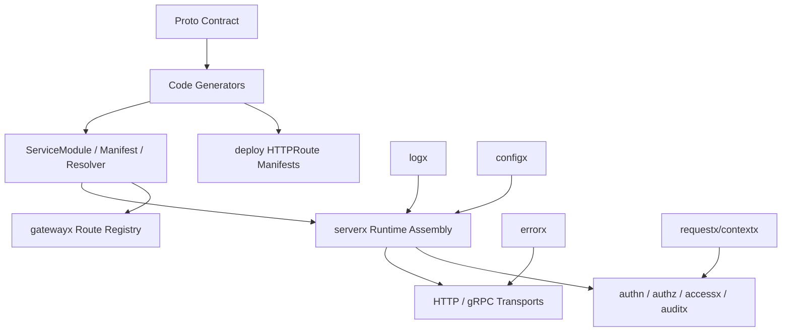

# Kernel 能力分层总览

这组文档按照 `github.com/aisphereio/kernel` 的真实代码组织，而不是按照愿景或产品口号组织。

Kernel 的目标不是做一个薄脚手架，而是把微服务开发中反复出现的基础能力沉到框架：错误协议、日志、配置、认证、授权、审计、请求元信息、服务装配、Gateway 路由、代码生成和部署路由生成。

## 分层模型



## 文档阅读顺序

| 顺序 | 文章 | 解决的问题 |
|---:|---|---|
| 1 | 基础能力：errorx / logx / configx | 框架如何统一错误、日志、配置和运行时观测基础 |
| 2 | 身份与权限：authn / authz / accessx / iamx | 框架如何隐藏 Casdoor/SpiceDB 等实现细节，提供 provider-neutral 接口 |
| 3 | 服务装配：serverx | 业务服务如何由生成的 ServiceModule 接入 HTTP、gRPC、AuthN、AuthZ、DB 和 migration |
| 4 | Gateway：gatewayx | 服务如何发布 Gateway Manifest，Gateway 如何过滤公开/内部/运维路由 |
| 5 | Proto 与生成器 | proto contract 如何驱动 request resolver、access resolver、gateway manifest 和 deploy manifest |
| 6 | 业务侧使用路径 | 基于 `kernel new` 的生成项目应该如何使用这些能力 |

## 当前主线边界

Kernel 代码里已经把能力分成三类：

| 类型 | 说明 | 示例 |
|---|---|---|
| Runtime API | 业务服务和生成代码可以依赖 | `errorx`、`logx`、`configx`、`serverx`、`gatewayx`、`authn`、`authz`、`accessx` |
| Framework assembly/helper | 框架内部装配层，业务一般不直接拼装 | `middleware/*`、`grpcx`、`restx`、`servicecontextx` |
| Tooling only | 只在生成/检查阶段使用，业务禁止 import | `cmd/kernel`、`cmd/protoc-gen-*`、`cmd/buf-check-*` |

## 一句话理解

Kernel 的主线是：

```text
proto contract
  -> buf-check-aisphere
  -> protoc generators
  -> requestx.Info / accessx.Check / gatewayx.Manifest / serverx.ServiceModule
  -> serverx/autowire
  -> business service
  -> Gateway route + deploy HTTPRoute manifests
```

也就是说：业务服务维护契约和领域逻辑，框架负责把契约变成运行时装配和部署材料。

## 注意事项

`validation/*` 当前仍在 Kernel 主模块中承载跨模块场景测试，但它不是 runtime API。业务代码不要 import `validation/*`。

`securityx` 是安全配置到运行时材料的构造层，不是新的中间件装配入口。服务端中间件装配仍应统一通过 `serverx` / `middleware/autowire`。
