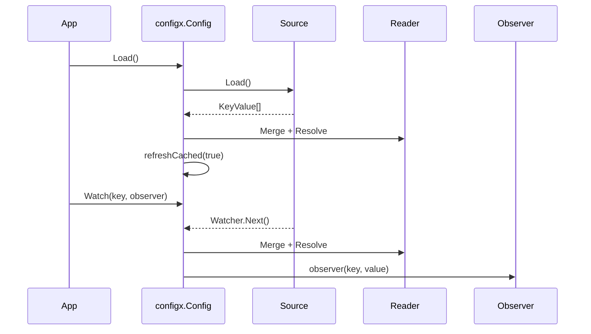
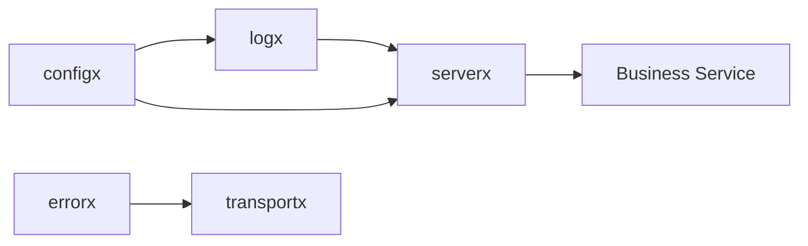

# 基础能力层：errorx / logx / configx

基础能力层解决的是所有服务都会遇到的问题：错误如何跨 HTTP/gRPC 表达，日志如何统一结构，配置如何加载、扫描、监听和热更新。

这层能力不应该散落在业务服务里。业务代码只应该使用稳定的框架接口。

## errorx：跨协议结构化错误

`errorx` 的核心是 `CodedError` 和 `Error`。

`CodedError` 是最小错误契约：

```go
// github.com/aisphereio/kernel/errorx/error.go
type CodedError interface {
    error
    Code() Code
    Message() string
    HTTPStatus() int
    Retryable() bool
}
```

`Error` 是 Kernel 的规范实现。它把错误码、用户消息、HTTP 状态码、gRPC code、是否可重试、cause、metadata、request_id、trace_id、category、severity、stack 都收在一个稳定结构里。

关键点：

| 能力 | 代码依据 | 作用 |
|---|---|---|
| 错误码 | `Code()` / `ErrorCode()` | 业务错误的稳定机器码 |
| 跨协议状态 | `HTTPStatus()` / `GRPCCode()` | 同一个错误可以映射 HTTP 和 gRPC |
| 可观测性 | `RequestID()` / `TraceID()` / `Severity()` | 日志、审计、链路追踪可以拿到一致字段 |
| 安全输出 | `PublicMetadata()` | 只暴露显式标记为安全的元数据 |
| 兼容封装 | `Unwrap()` / `Is()` | 支持 Go 标准 `errors.Is/As` |

### 为什么不是直接返回普通 error

普通 `error` 只能表达字符串，无法稳定地告诉 transport：

- HTTP 应该返回 400、401、403、404 还是 500；
- gRPC 应该返回什么 status code；
- 错误是否可重试；
- 哪些 metadata 可以给客户端，哪些只能进入内部日志；
- 这个错误的 request_id / trace_id 是什么。

所以业务服务应该优先使用 `errorx.BadRequest`、`errorx.NotFound`、`errorx.Conflict` 等构造函数，而不是临时 `fmt.Errorf` 直接透出。

## logx：基于 slog 的统一日志门面

`logx` 基于 Go 标准库 `log/slog`，提供默认 logger、包级 helper 和配置模型。

常用包级函数包括：

```go
logx.Debug("message", "key", value)
logx.Info("message", "key", value)
logx.Warn("message", "key", value)
logx.Error("message", "key", value)
logx.InfoContext(ctx, "message", "key", value)
```

实现上，`logx` 会使用 `slog.Default().Handler()`，并用 `slog.NewRecord` 构造带 source PC 的记录。这意味着业务代码可以用简单函数调用，但最终仍走标准 slog handler 管线。

### logx.Config

`logx.Config` 描述服务级日志行为：

| 字段 | 含义 |
|---|---|
| `service_name` | 服务名 |
| `env` | 环境名，如 dev/prod |
| `version` | 服务版本 |
| `node_id` | 节点 ID |
| `level` | 日志级别 |
| `format` | JSON 或 console |
| `output` | stdout、stderr 或文件路径 |
| `add_source` | 是否记录源码位置 |
| `redact` | 脱敏配置 |
| `sampling` | 采样配置 |
| `access_log` | 访问日志配置 |

默认配置会在 dev/local 使用 console 格式，在其他环境使用 JSON 格式；默认开启脱敏，并跳过 `/healthz`、`/readyz`、`/metrics` 这类探针路径的访问日志。

## configx：统一配置加载、扫描、监听

`configx.Config` 是运行时配置接口：

```go
// github.com/aisphereio/kernel/configx/config.go
type Config interface {
    Load() error
    Scan(v any) error
    Value(key string) Value
    Watch(key string, o Observer) error
    Close() error
}
```

它的职责是：

1. 从一个或多个 source 加载配置；
2. merge 多份配置；
3. 解析变量引用；
4. 提供 `Value(key)` 和 `Scan(v)`；
5. 支持 Watcher 监听配置变化；
6. 在配置变化后刷新缓存并通知 observer。

### 运行时流程



## 三者如何配合



- `configx` 负责把配置加载进运行时；
- `logx` 根据配置构造日志行为；
- `errorx` 负责业务错误的跨协议表达；
- `serverx` 在服务启动和请求链路里统一消费这些能力。

## 业务侧建议

业务代码应该：

- 用 `errorx` 返回可识别、可映射、可审计的错误；
- 用 `logx` 或注入的 logger 记录结构化日志；
- 通过服务启动层读取 `configx`，不要在 handler 内自己读取文件；
- 不要把 secret、token、password 等字段塞进 error metadata 或普通日志字段。
