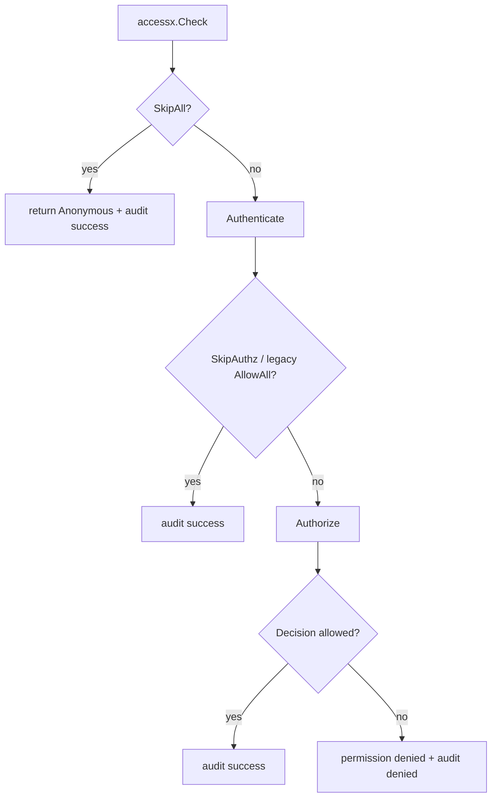
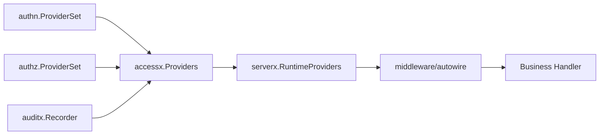

# 身份与访问控制层：authn / authz / accessx / iamx

身份与访问控制层解决四个问题：

1. 谁在调用系统；
2. 这个调用者是否已经通过认证；
3. 这个调用者是否有权访问目标资源；
4. 认证、授权、审计如何在服务请求链路里自动装配。

Kernel 在这里的核心原则是：**业务代码依赖 Kernel 接口，不依赖具体 Provider SDK**。

也就是说，业务不应该散落 import Casdoor SDK、SpiceDB SDK、Casbin SDK。具体实现应该被适配到 `authn` / `authz` / `accessx` 的 provider-neutral 接口后，再进入 `serverx`。

## authn：认证接口层

`authn.Provider` 是 Kernel 默认认证面：

```go
// github.com/aisphereio/kernel/authn/provider.go
type Provider interface {
    Authenticator
    TokenService
    LoginService
    LogoutService
}
```

它由更小的接口组合而成。

### Authenticator

```go
// github.com/aisphereio/kernel/authn/service.go
type Authenticator interface {
    Authenticate(ctx context.Context, credential Credential) (Principal, error)
}
```

这个接口只做一件事：把 transport credential 转成规范化的 `Principal`。

credential 可以来自：

- Bearer Token；
- Gateway 注入的 trusted principal header；
- 内部服务 token；
- 其他未来扩展的 API Key / mTLS identity。

### TokenService

```go
type TokenService interface {
    ExchangeCode(ctx context.Context, req AuthCodeExchangeRequest) (TokenSet, Principal, error)
    RefreshToken(ctx context.Context, req RefreshTokenRequest) (TokenSet, error)
    VerifyToken(ctx context.Context, req VerifyTokenRequest) (Principal, error)
    RevokeToken(ctx context.Context, req RevokeTokenRequest) error
}
```

这组接口覆盖 OAuth/OIDC token 生命周期：code exchange、refresh、verify、revoke。

### LoginService / LogoutService

`LoginService` 负责构造身份提供方登录 URL；`LogoutService` 负责构造身份提供方 end-session URL。

`LogoutService` 的注释已经明确它要构造 OIDC RP-Initiated Logout 参数，包括：

- `id_token_hint`
- `post_logout_redirect_uri`
- `state`
- `client_id`

这意味着后端服务可以返回一个完整 redirect URL，而不是让业务 handler 手写 provider-specific URL。

### ManagementProvider

```go
type ManagementProvider interface {
    Provider
    IdentityAdmin
}
```

`ManagementProvider` 是控制面能力，用于 IAM 管理、用户/组织/应用/组管理，不是普通业务 handler 的热路径。

业务模块通常只需要：

- 读取当前 `Principal`；
- 调用 IAM 服务；
- 或通过 `serverx` 自动注入 authn/authz middleware。

不要在业务包里直接操作身份提供方用户、组织、应用。

## authz：授权接口层

`authz.Provider` 是运行时授权面：

```go
// github.com/aisphereio/kernel/authz/provider.go
type Provider interface {
    Authorizer
}
```

`Authorizer` 只做权限检查：

```go
// github.com/aisphereio/kernel/authz/service.go
type Authorizer interface {
    Check(ctx context.Context, req CheckRequest) (Decision, error)
}
```

控制面使用更完整的 `authz.Service`：

```go
type Service interface {
    Authorizer
    BatchAuthorizer
    ResourceLookup
    SubjectLookup
    RelationshipStore
    SchemaManager
}
```

这说明 Kernel 把授权拆成两条路径：

| 路径 | 接口 | 使用者 |
|---|---|---|
| 请求热路径 | `Authorizer.Check` | 普通业务服务、access middleware |
| 授权控制面 | `RelationshipStore` / `SchemaManager` / Lookup APIs | IAM、资源管理、关系投影、后台任务 |

## accessx：认证、授权、审计编排层

`accessx` 不是新的 Provider SDK，而是请求时的访问控制编排层。

核心结构是 `Check`：

```go
type Check struct {
    Credential authn.Credential
    Principal  authn.Principal
    Permission string
    Resource   authz.ObjectRef
    SkipPolicy SkipPolicy
    TenantID   string
    OrgID      string
    ProjectID  string
    AuditAction string
    RequestID   string
    TraceID     string
}
```

### SkipPolicy

`SkipPolicy` 是当前主线的短路策略：

| 策略 | 含义 | 场景 |
|---|---|---|
| `SkipDefault` | 正常认证 + 授权 | 默认业务接口 |
| `SkipAuthz` | 要认证，但跳过 SpiceDB 授权检查 | `GetMe`、创建组织这类 bootstrap/self-service 接口 |
| `SkipAll` | 跳过认证和授权 | login、token exchange、healthz 等公开接口 |

注意：`AuthzMode` 和 `AllowAll` 在代码里仍保留兼容，但已经标记 deprecated，新代码应该只使用 `SkipPolicy`。

### Guard.Require

`Guard.Require` 的运行顺序是：



这条链路里的重点是：认证结果、授权结果和审计记录是一个统一决策过程，不应该在业务 handler 里散落 `if user == nil`、`if role == admin` 这类逻辑。

## iamx：IAM 领域辅助

`iamx` 当前是非常轻的 IAM 领域辅助包，不是完整 IAM runtime。

它只定义了 IAM 领域错误码和辅助函数：

```go
const (
    CodeInvalidArgument = "IAM_INVALID_ARGUMENT"
    CodeNotFound        = "IAM_NOT_FOUND"
    CodeConflict        = "IAM_CONFLICT"
)

func ErrInvalidArgument(message string) error { return errorx.BadRequest(CodeInvalidArgument, message) }
func ErrNotFound(message string) error        { return errorx.NotFound(CodeNotFound, message) }
func ErrConflict(message string) error        { return errorx.Conflict(CodeConflict, message) }
```

所以不要把 `iamx` 理解为 IAM 服务本体。IAM 服务本体应该在 `aisphere-iam` 仓库里实现，Kernel 只提供跨服务可复用的接口、错误和装配能力。

## 和 serverx 的关系

身份与权限层最终通过 `serverx.RuntimeProviders` 进入服务装配：



业务服务不应该自己拼装完整 authn/authz/audit middleware。推荐路径是：

1. 启动层通过配置构造 `securityx.Runtime`；
2. 把 runtime 放进 `serverx.RuntimeProviders`；
3. `serverx` 统一装配 middleware；
4. 业务 handler 从 context 中读取已经注入的 Principal，并专注领域逻辑。

## 业务侧规则

- 普通业务包不要 import Casdoor SDK、SpiceDB SDK；
- 普通业务包不要直接写权限关系；
- 需要权限检查时，优先让 proto access policy 生成 `AccessResolver`；
- bootstrap/self-service 场景用 `SkipPolicy=SkipAuthz`，不要继续扩展 `AllowAll`；
- 公开接口用 `SkipPolicy=SkipAll`，并明确它不会提供已认证 Principal；
- IAM 领域错误使用 `iamx`，但 IAM 服务本体仍在 `aisphere-iam`。
