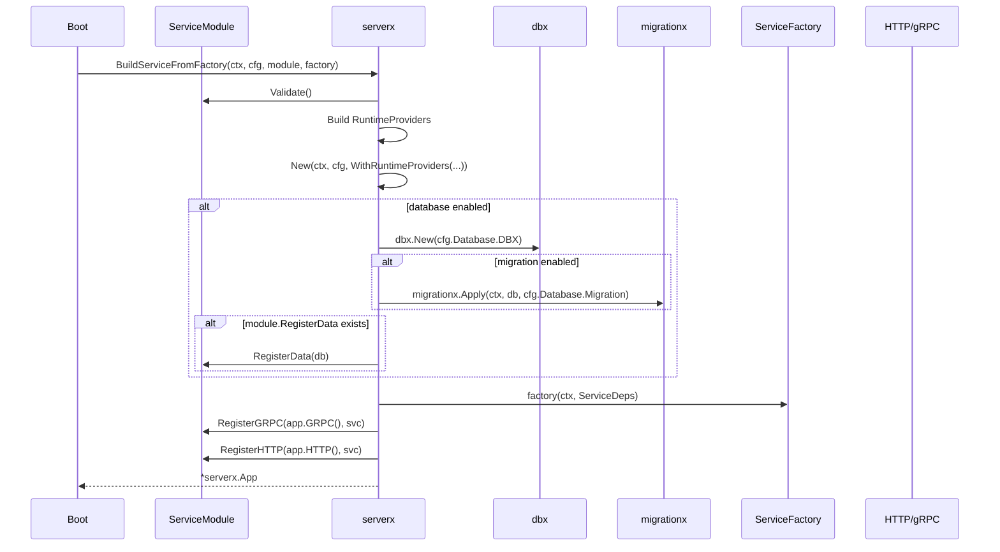
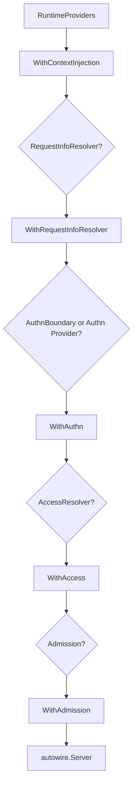

# 服务装配层：serverx

`serverx` 是 Kernel 的服务装配主线。它的职责不是提供一个普通 HTTP server，而是把生成的服务模块、请求元信息、认证、授权、审计、准入、数据库和迁移统一装配成可运行服务。

业务服务不应该在 `main.go` 里手写一大堆 transport、middleware、authn、authz、migration 绑定。正确方向是：proto 生成 `ServiceModule`，启动层把 Provider 和配置交给 `serverx`。

## ServiceModule：生成服务的入口契约

`serverx.ServiceModule` 是生成代码和运行时之间的关键接口。

```go
// github.com/aisphereio/kernel/serverx/module.go
type ServiceModule struct {
    Name string
    GatewayManifest gatewayx.Manifest
    RequestInfoResolver requestx.Resolver
    AccessResolver accessmw.Resolver
    RegisterGRPC func(*transportgrpc.Server, any) error
    RegisterHTTP func(*transporthttp.Server, any) error
    RegisterGatewayInvokers func(*gatewayx.InvokerRegistry, any) error
    RegisterData func(dbx.DB) (any, error)
}
```

从字段可以看出，`ServiceModule` 不是简单的“服务名”。它把一个 proto service 所需的运行时材料都带进来：

| 字段 | 来源 | 用途 |
|---|---|---|
| `GatewayManifest` | `protoc-gen-go-gateway` | Gateway 路由注册 |
| `RequestInfoResolver` | `protoc-gen-go-kernel` / access metadata | 请求元信息注入 |
| `AccessResolver` | proto access policy | 把请求映射为 `accessx.Check` |
| `RegisterGRPC` | gRPC 生成代码 | 注册 gRPC 服务 |
| `RegisterHTTP` | HTTP/gateway 生成代码 | 注册 HTTP/JSON 路由 |
| `RegisterGatewayInvokers` | Gateway 生成代码 | 注册 Gateway -> gRPC invoker |
| `RegisterData` | 生成或手写 data 模块 | 从 Kernel-managed DB 构造 repo |

## Validate：拒绝不完整模块

`ServiceModule.Validate()` 会要求模块必须有名称或 Gateway service 名，并且必须有：

- `RequestInfoResolver`
- `AccessResolver`

这说明 Kernel 认为请求元信息和访问控制不是可选胶水，而是服务模块的基本能力。

## BuildService / BuildServiceFromFactory

`serverx.BuildService` 用于已有 service 实例；`BuildServiceFromFactory` 是更完整的路径。

运行顺序可以理解为：



## RuntimeProviders：Provider-neutral 装配入口

`serverx.RuntimeProviders` 是把安全、请求元信息、访问控制和准入统一塞入 middleware/autowire 的入口。

它包含：

| 字段 | 作用 |
|---|---|
| `Security` | 推荐入口，由 `securityx.NewRuntime` 生成 |
| `Access` | `authn` / `authz` / `auditx` 的 provider-neutral bundle |
| `AccessResolver` | 从请求操作映射到 `accessx.Check` |
| `SkipPolicyResolver` | 配置驱动的短路策略 |
| `RequestInfoResolver` | 请求元信息解析 |
| `Admission` | K8s 风格 mutating/validating hooks |
| `AuthnBoundary` | 兼容显式 AuthN runtime 注入 |

`ServerMiddleware()` 的装配顺序大致是：



## serverx 和 securityx 的边界

`securityx` 负责从 `config.yaml` 构造安全运行时材料，例如：

- OIDC/JWKS authenticator；
- Gateway trusted header authenticator；
- hybrid authenticator；
- internal-service-token 配置；
- access skip policy resolver。

但 `securityx` 不应该成为新的中间件装配入口。中间件顺序仍由 `serverx` / `middleware/autowire` 统一决定。

因此推荐方式是：

```go
securityRuntime, _ := securityx.NewRuntime(ctx, cfg.Security, cache)
app, _ := serverx.New(ctx, cfg.Server,
    serverx.WithRuntimeProviders(serverx.RuntimeProviders{
        Security: securityRuntime,
        AccessResolver: module.AccessResolver,
        RequestInfoResolver: module.RequestInfoResolver,
    }),
)
```

实际项目里这部分应由生成代码和 boot 层进一步封装，业务 handler 不需要直接关心。

## 为什么 serverx 是上层主线

因为它把很多“每个服务都会重复写”的逻辑收敛了：

| 传统服务写法 | Kernel 写法 |
|---|---|
| main.go 手动创建 HTTP server | `serverx.New` |
| 手动注册 gRPC/HTTP | `ServiceModule.RegisterGRPC/RegisterHTTP` |
| 手写 auth middleware 顺序 | `RuntimeProviders.ServerMiddleware()` |
| handler 里硬解析 path/method | `RequestInfoResolver` |
| handler 里硬编码权限 | `AccessResolver` + `accessx.Guard` |
| migration 手动执行 | `BuildServiceFromFactory` 里根据配置执行 |
| repo 手动 new | `RegisterData(dbx.DB)` |

## 业务侧规则

- 新服务应该通过 `kernel new` + proto generator 进入 `serverx` 路径；
- 不要在每个业务服务里手动拼 authn/authz/audit middleware；
- 不要绕过 `RequestInfoResolver` 和 `AccessResolver`；
- 数据库和 migration 应由服务启动层统一处理；
- 业务 handler 只处理领域逻辑，不处理框架装配。
