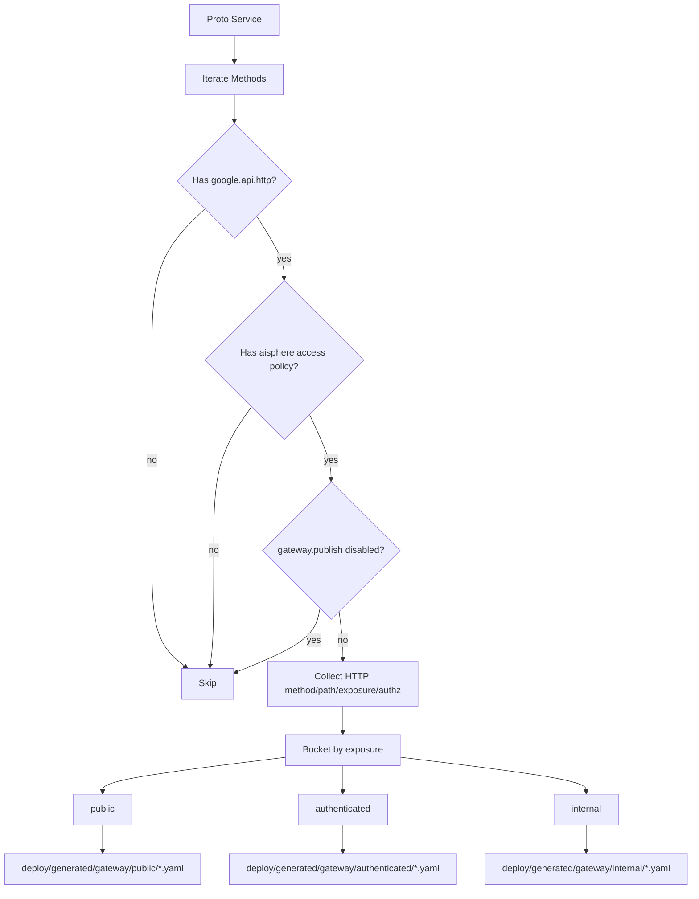

# Gateway 层：gatewayx 与 deploy HTTPRoute

Kernel 里有两类 Gateway 相关能力，容易混在一起：

| 能力 | 代码位置 | 产物 | 运行位置 |
|---|---|---|---|
| Gateway runtime manifest | `gatewayx`、`protoc-gen-go-gateway` | `gatewayx.Manifest` / `GatewayRoute` / invoker | Aisphere Gateway 运行时 |
| Deploy route manifests | `cmd/protoc-gen-go-deploy` | Kubernetes Gateway API `HTTPRoute` YAML | Kubernetes / Gateway API controller |

两者都来自 proto contract，但用途不同。

## gatewayx：服务发布给 Gateway 的运行时路由表

`gatewayx.GatewayRoute` 是从 `google.api.http` 和 `aisphere.access.v1.policy` 生成的运行时路由声明：

```go
// github.com/aisphereio/kernel/gatewayx/manifest.go
type GatewayRoute struct {
    ID       string
    Method   string
    Path     string
    Upstream UpstreamRef
    Gateway  GatewayPolicy
    Access   accessx.AccessRule
}
```

关键字段：

| 字段 | 含义 |
|---|---|
| `Method` / `Path` | 外部 HTTP 路由 |
| `Upstream` | 后端 Kubernetes Service / namespace / port / gRPC operation |
| `Gateway` | 边界治理策略，如 exposure、authn mode、timeout、profiles、tags |
| `Access` | provider-neutral 访问控制声明，可由 Gateway 执行或转交 IAM |

## GatewayPolicy：边界治理策略

`GatewayPolicy` 负责描述“网关边界如何处理这个路由”：

```go
type GatewayPolicy struct {
    Exposure             accessv1.Exposure
    AuthnMode            AuthnMode
    ForwardAuthorization bool
    Timeout              time.Duration
    Profiles             []string
    Tags                 []string
}
```

`EffectiveAuthnMode()` 会根据 exposure 推导默认行为：

| Exposure | 默认 AuthN mode | 解释 |
|---|---|---|
| `PUBLIC` | `none` | 公开接口，不要求登录 |
| `AUTHENTICATED` | `verify_jwt` | 网关侧验证 JWT |
| `AUTHORIZED` | `verify_jwt` | 网关侧验证身份，授权由 access policy 决定 |
| `INTERNAL` | `none` | 内部路由通常走内部信任边界 |
| `SYSTEM` | `none` | 系统路由 |
| 未知 | `passive` | 保守透传/被动模式 |

## Manifest 与 RouteRegistry

一个服务发布的是 `gatewayx.Manifest`：

```go
type Manifest struct {
    Service   string
    Namespace string
    Routes    []GatewayRoute
}
```

Gateway runtime 通过 `RouteRegistry` 注册和读取路由：

```go
type RouteRegistry interface {
    RegisterManifest(manifest Manifest) error
    ListRoutes() []GatewayRoute
}
```

当前代码里有 `MemoryRegistry`，用于本地/demo/测试。生产实现应该是 etcd 或其他服务注册后端。

## RouteFilter：公开网关、内部网关、运维网关分离

`gatewayx.RouteFilter` 在注册时过滤路由，而不是只在请求时过滤。这样可以避免内部/调试路由泄漏到公开 Gateway 的 route registry。

内置了三类典型过滤器：

| 函数 | 作用 |
|---|---|
| `PublicRouteFilter()` | 发布 `PUBLIC`、`AUTHENTICATED`、`AUTHORIZED`，排除 `INTERNAL`、`SYSTEM`，同时排除 `/internal/*`、`/debug/*`、`/metrics`、`/healthz`、`/readyz` |
| `InternalRouteFilter()` | 发布认证/授权/内部/系统路由，但仍排除 debug/metrics/health/readiness |
| `OpsRouteFilter()` | 只发布 `profiles` 中带 `ops` 的路由 |

这说明 Gateway 不是“把所有路由都注册进去再判断”，而是按网关实例的职责提前裁剪。

## serverx 如何注册 Gateway routes

`serverx.RegisterServiceGatewayRoutesWithFilter` 会：

1. 读取每个 `ServiceModule.GatewayManifest`；
2. 按 `RouteFilter` 调用 `gatewayx.FilterManifest`；
3. 把过滤后的 manifest 注册到 `RouteRegistry`。


## deploy HTTPRoute：生成 Kubernetes Gateway API 资源

`protoc-gen-go-deploy` 是另一条链路。它不生成 Go runtime manifest，而是生成 Kubernetes Gateway API `HTTPRoute` YAML。

生成器参数包括：

| 参数 | 默认值 | 含义 |
|---|---|---|
| `service` | proto service name 派生 | backend Kubernetes Service 名 |
| `namespace` | `aisphere` | HTTPRoute 与 backendRef namespace |
| `backend_port` | `19080` | backend gRPC service port |
| `parent_namespace` | `aisphere-system` | Gateway 所在 namespace |
| `public_gateway` | `public-gateway` | PUBLIC 路由挂载的 Gateway |
| `authenticated_gateway` | `authenticated-gateway` | AUTHENTICATED/AUTHORIZED 路由挂载的 Gateway |
| `internal_gateway` | `internal-gateway` | INTERNAL/SYSTEM 路由挂载的 Gateway |

## deploy 生成流程

`protoc-gen-go-deploy` 的核心流程是：



生成目录：

```text
deploy/generated/gateway/public/
deploy/generated/gateway/authenticated/
deploy/generated/gateway/internal/
```

Exposure 分桶规则：

| Exposure | Bucket |
|---|---|
| `PUBLIC` | `public` |
| `AUTHENTICATED` | `authenticated` |
| `AUTHORIZED` | `authenticated` |
| `INTERNAL` | `internal` |
| `SYSTEM` | `internal` |

## HTTPRoute 中写入的 Header

生成器会为每条 route 加 `RequestHeaderModifier`，写入：

| Header | 含义 |
|---|---|
| `X-Aisphere-Upstream-Operation` | 目标 gRPC full method |
| `X-Aisphere-Route-Exposure` | 路由 exposure |
| `X-Aisphere-Route-Authn-Mode` | `none` / `verify_jwt` / `m2m` |
| `X-Aisphere-Route-Forward-Authorization` | 是否向后端转发 Authorization |
| `X-Aisphere-Authz-Action` | 可选授权动作 |
| `X-Aisphere-Authz-Resource` | 可选授权资源 |

这些 header 让 Gateway Controller 或边缘鉴权组件可以消费同一份 proto contract 派生出来的治理信息。

## 当前需要注意的实现细节

当前 deploy generator 对 HTTPRoute path 使用 `PathPrefix`。这对简单前缀路由可用，但对包含 `{id}` 的 path template 后续还需要增强为更准确的 `Exact` / `RegularExpression` / controller-specific template 方案。

因此这篇文档描述的是当前真实实现，不代表 path matcher 已经完成最终形态。

## 业务侧规则

- 服务不手写 Gateway runtime manifest，交给 `protoc-gen-go-gateway`；
- 服务不手写 Gateway API HTTPRoute，交给 `protoc-gen-go-deploy`；
- 公开/认证/内部路由通过 proto access policy 声明；
- 公开 Gateway 必须使用 `PublicRouteFilter()` 或同等过滤策略；
- 内部和系统路由不能混入 public route registry；
- `deploy/generated/gateway/*` 应作为部署制品进入业务仓库。
