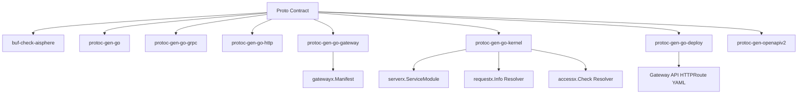

# Proto 与生成器层

Kernel 的开发范式是 proto-first：业务服务先声明 contract，再由生成器产生运行时 glue。这里的 contract 不只是 `message` 和 `rpc`，还包括 HTTP 路由、访问策略、审计、能力标签、Gateway 发布策略和部署路由。

## 为什么 proto 是入口

传统写法里，同一个 API 的信息会散落在多个地方：

- proto 定义 gRPC；
- HTTP router 单独写 path；
- Gateway 单独写 route；
- IAM 单独写权限；
- OpenAPI 单独生成或手写；
- Kubernetes Gateway API HTTPRoute 单独写 YAML；
- handler 里再手动判断权限。

Kernel 的方向是：这些都应该从同一份 proto contract 派生。



## 生成器职责表

| 生成器 | 主要产物 | 用途 |
|---|---|---|
| `protoc-gen-go` | Go DTO | message 类型 |
| `protoc-gen-go-grpc` | gRPC server/client interface | gRPC 调用与注册 |
| `protoc-gen-go-http` | HTTP server glue | HTTP/JSON 路由注册 |
| `protoc-gen-grpc-gateway` | grpc-gateway glue | 兼容 grpc-gateway 生态 |
| `protoc-gen-go-errors` | errorx helpers | 统一错误构造 |
| `protoc-gen-go-authz` | authz helper | 更丰富的权限辅助 |
| `protoc-gen-go-gateway` | `gatewayx.Manifest` / invoker | Aisphere Gateway runtime |
| `protoc-gen-go-kernel` | `serverx.ServiceModule` / resolver | 服务装配主线 |
| `protoc-gen-go-deploy` | Gateway API `HTTPRoute` YAML | Kubernetes 部署路由 |
| `buf-check-aisphere` | contract 检查 | 防止 proto 缺少策略或不符合规范 |

## protoc-gen-go-kernel

`protoc-gen-go-kernel` 负责把 proto service 转成 `serverx.ServiceModule`。

生成的模块包含：

- `Name`
- `GatewayManifest`
- `RequestInfoResolver`
- `AccessResolver`
- `RegisterGRPC`
- `RegisterHTTP`
- `RegisterGatewayInvokers`

这对应 `serverx.ServiceModule` 的运行时入口。

### 解析 access policy

生成器会读取 method option 中的 Kernel access policy：

- `Exposure`
- `Authz.Action`
- `Authz.Resource`
- `Authz.Audience`
- `Authz.Mode`
- `Audit.Event`
- `Audit.Risk`
- `Capability`

如果 policy 存在但没有指定 exposure，当前默认 `AUTHENTICATED`。

### 生成 RequestInfoResolver

`KernelRequestInfoResolver` 会把 operation 映射成 `requestx.Info`：

```go
info := requestx.Info{
    Service: serviceFullName,
    Method: methodName,
    Operation: fullMethod,
    Exposure: exposure,
    Action: action,
    Resource: resource,
    TargetService: audience,
    Labels: map[string]string{},
}
```

这些信息会进入后续 authn/authz/audit/metrics 链路。

### 生成 AccessResolver

`KernelAccessResolver` 会把 operation 映射成 `accessx.Check`：

```go
check := accessx.Check{
    Permission: rule.Action,
    Resource: resource,
    AuditAction: rule.AuditEvent,
    Metadata: map[string]any{
        "authz_rule": rule.FullMethod,
        "authz_mode": string(rule.Mode),
    },
}
```

如果找不到 rule，或者 rule 没有 action，则返回 `false`，表示这个 operation 没有生成 access check。

## protoc-gen-go-gateway

`protoc-gen-go-gateway` 负责生成 Gateway runtime 使用的 manifest 和 invoker。它的产物不是 Kubernetes YAML，而是 Go 代码中的 `gatewayx.Manifest`。

该 manifest 最终可通过 `serverx.RegisterServiceGatewayRoutesWithFilter` 注册进 Gateway route registry。

## protoc-gen-go-deploy

`protoc-gen-go-deploy` 负责生成 Kubernetes Gateway API `HTTPRoute`。

它读取：

- `google.api.http`
- `aisphere.access.v1.policy`
- Gateway publish 配置
- exposure
- authz action/resource
- profiles/tags

并写入：

```text
deploy/generated/gateway/public/
deploy/generated/gateway/authenticated/
deploy/generated/gateway/internal/
```

### deploy generator 与 gateway generator 的区别

| 问题 | `protoc-gen-go-gateway` | `protoc-gen-go-deploy` |
|---|---|---|
| 输出什么 | Go runtime manifest | Kubernetes YAML |
| 给谁用 | Aisphere Gateway 进程 | Gateway API controller / 部署系统 |
| 是否进入 Go 编译 | 是 | 否 |
| 是否在 `deploy/` 目录 | 否 | 是 |
| 主要作用 | 运行时路由/调用 | 集群入口路由声明 |

## buf-check-aisphere

`buf-check-aisphere` 是 proto contract 检查器。它的职责不是生成代码，而是在生成前发现契约缺失或不符合规范。

典型应检查：

- full profile 的外部 RPC 是否声明 `google.api.http`；
- 是否声明 `aisphere.access.v1.policy`；
- 错误码是否符合命名规范；
- 访问策略是否可生成 `requestx.Info` 和 `accessx.Check`；
- Gateway publish 策略是否明确。

## 生成项目的标准流程

```bash
make tools
make api
make deploy
make proto-check
make verify
```

含义：

| 命令 | 作用 |
|---|---|
| `make tools` | 安装本项目本地 `.bin` 工具链 |
| `make api` | 生成 Go/gRPC/HTTP/Gateway/runtime glue/OpenAPI |
| `make deploy` | 生成 Gateway API HTTPRoute 部署清单 |
| `make proto-check` | lint + Kernel contract check |
| `make verify` | 跑完整本地门禁 |

## 业务侧规则

- 不要长期手写 resolver 文件来弥补生成器缺口；
- `_kernel.pb.go` 编译失败时，优先修 Kernel generator；
- Gateway runtime manifest 和 HTTPRoute deploy manifest 是两种产物，不要混用；
- 新业务服务应通过 proto contract 声明 exposure、authz、audit、gateway publish；
- `make tools` 安装项目本地工具链，不要求开发者全局安装每个 `protoc-gen-*`。
