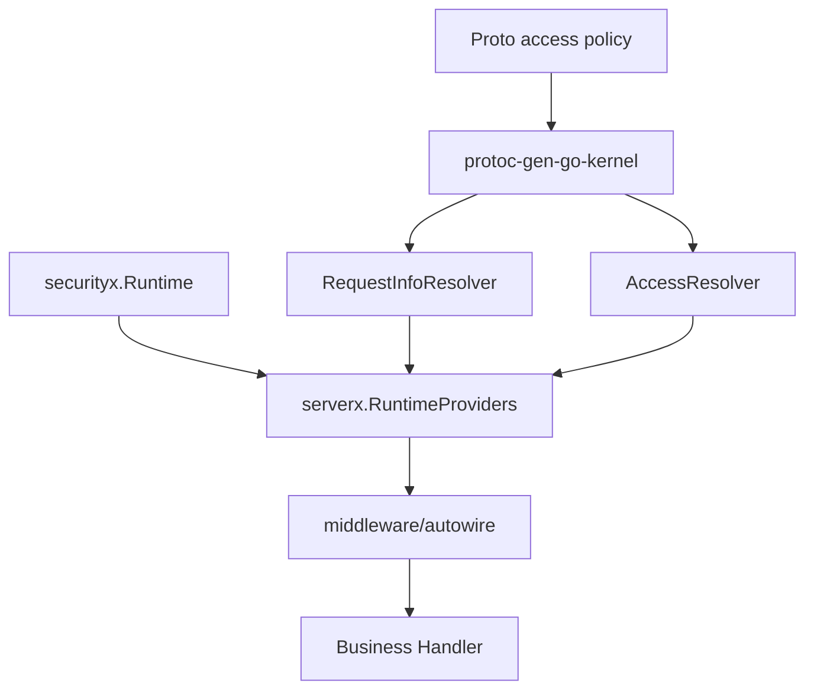
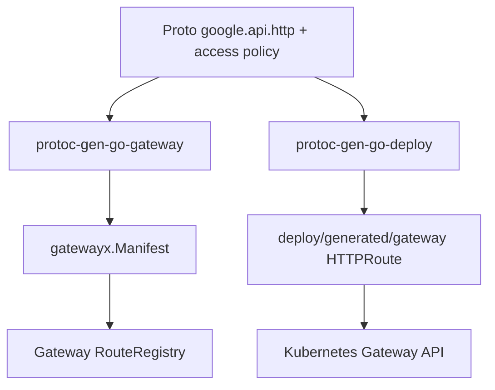

# 业务服务如何使用 Kernel 能力

这篇文档从业务服务视角说明：一个基于 Kernel 的服务应该如何使用前面几层能力。

核心原则：**业务只写契约和领域逻辑，框架能力由生成代码和 serverx 装配。**

## 标准开发流程

```bash
go install github.com/aisphereio/kernel/cmd/kernel@latest
kernel new todo-service
cd todo-service
make tools
make api
make deploy
make proto-check
make verify
make run
```

`kernel` CLI 是唯一建议全局安装的工具。其他生成器通过生成项目里的 `make tools` 安装到本地 `.bin`。

## 生成项目后，每类文件的职责

| 位置 | 职责 |
|---|---|
| `api/**/*.proto` | 服务契约、HTTP 绑定、access policy、错误码、能力声明 |
| `api/**/*.pb.go` | Go DTO |
| `api/**/*_grpc.pb.go` | gRPC glue |
| `api/**/*_http.pb.go` | HTTP glue |
| `api/**/*_gateway.pb.go` | Gateway runtime manifest / invoker |
| `api/**/*_kernel.pb.go` | serverx ServiceModule / request/access resolver |
| `deploy/generated/gateway/*` | Kubernetes Gateway API HTTPRoute |
| `internal/biz` | 领域逻辑 |
| `internal/data` | repo / data access |
| `internal/service` | service handler，尽量薄 |
| `cmd/server` | 启动入口 |
| `configs/config.yaml` | 运行时配置 |

## Handler 应该做什么

Handler 只应该：

1. 接收 request；
2. 调用 biz/service；
3. 返回 response 或 errorx 错误。

Handler 不应该：

- 手动解析 Authorization；
- 直接调用 Casdoor SDK；
- 直接调用 SpiceDB SDK；
- 手动判断 path/method；
- 手写 Gateway 路由；
- 手写 Kubernetes HTTPRoute；
- 在业务逻辑里到处拼装 logger/config/db。

## AuthN/AuthZ 的正确路径



这条链路的含义是：

- proto 里声明接口的 exposure、authz action、resource、audit；
- 生成器产生 request/access resolver；
- 启动层构造 security runtime；
- serverx 装配 authn/authz/audit middleware；
- handler 只拿到已经被处理过的请求上下文。

## Gateway 的正确路径



注意这里有两条产物链：

1. `gatewayx.Manifest` 给 Aisphere Gateway 运行时用；
2. `HTTPRoute` YAML 给 Kubernetes Gateway API 用。

两者都来自 proto，但不是同一个东西。

## 错误处理的正确路径

业务错误应该走 `errorx`：

```go
return nil, errorx.NotFound("TODO_NOT_FOUND", "todo not found")
```

不要直接返回无结构的 `fmt.Errorf("not found")` 给 transport 层。`errorx` 会携带 code、HTTP status、gRPC code、severity、request_id/trace_id 等信息，便于统一响应、日志和审计。

## 日志和配置的正确路径

- `logx` 是结构化日志主线，基于 `slog`；
- `configx` 是配置加载、扫描和 watch 主线；
- 服务启动层应该从配置构造 logger、server、security、database 等 runtime；
- handler 不应该自己读配置文件。

## IAM 相关边界

`iamx` 不是 IAM 服务本体。它目前只承载 IAM 领域错误码和 helper。

IAM 服务本体应在 `aisphere-iam` 实现。业务服务需要 IAM 能力时，应该调用 IAM 服务或依赖 Kernel 的 `authn` / `authz` / `accessx` 接口，而不是把 IAM 管理逻辑复制进各个业务服务。

## 最小业务开发心智

业务开发者只需要记住这几条：

| 做 | 不做 |
|---|---|
| 写 proto contract | 不手写 Gateway route |
| 写 biz 领域逻辑 | 不在 handler 里硬编码权限 |
| 使用 errorx | 不裸返回不可识别 error |
| 使用生成代码 | 不长期维护手写 resolver |
| 通过 serverx 启动 | 不在每个服务里重复拼中间件 |
| 通过 make tools/api/deploy 生成 | 不手动全局安装所有 protoc-gen 工具 |

## 当前后续待完善点

根据当前 Kernel 代码，仍有一些后续演进点：

- `validation/*` 应继续迁移到独立 validation surface 或 build-tag 专用测试；
- `accessx.AuthzMode` / `AllowAll` 仍在兼容，后续应彻底迁移到 `SkipPolicy`；
- `contextx.Principal` 和 `authn.Principal` 的边界还需要进一步收口；
- `protoc-gen-go-deploy` 的 HTTPRoute path matcher 目前使用 `PathPrefix`，含 `{id}` 的 path template 后续需要更准确的 matcher 策略。

这些不是业务服务要绕开的点，而是 Kernel 后续框架层继续收敛的方向。
